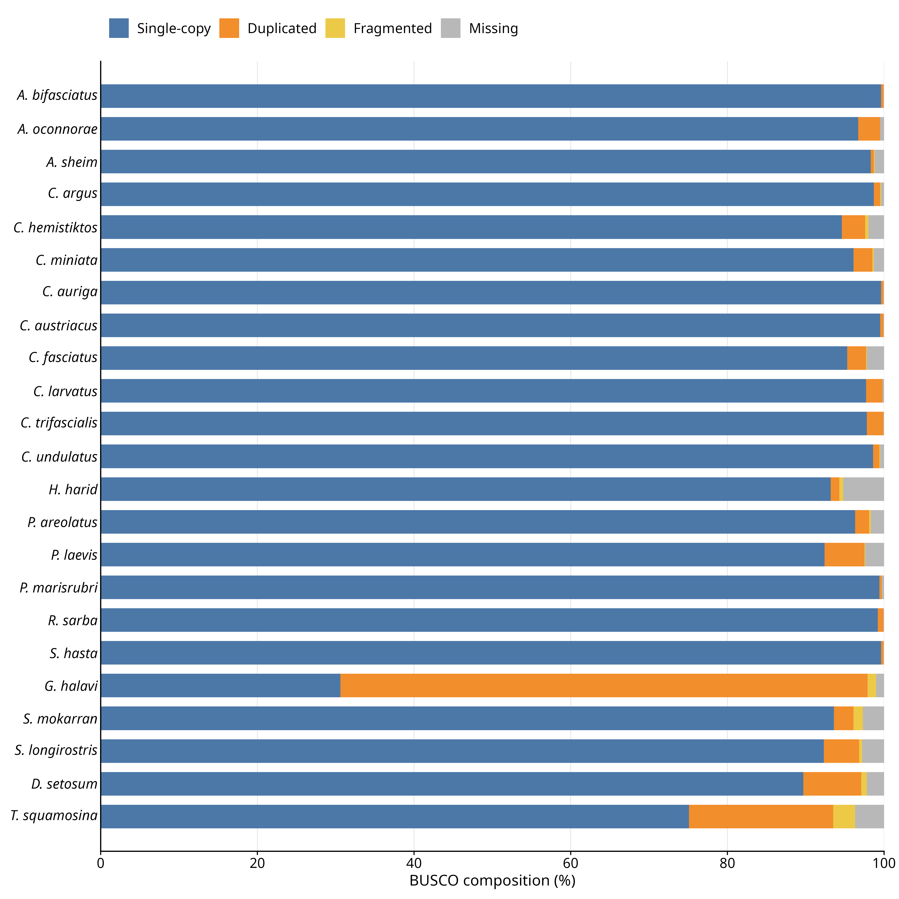
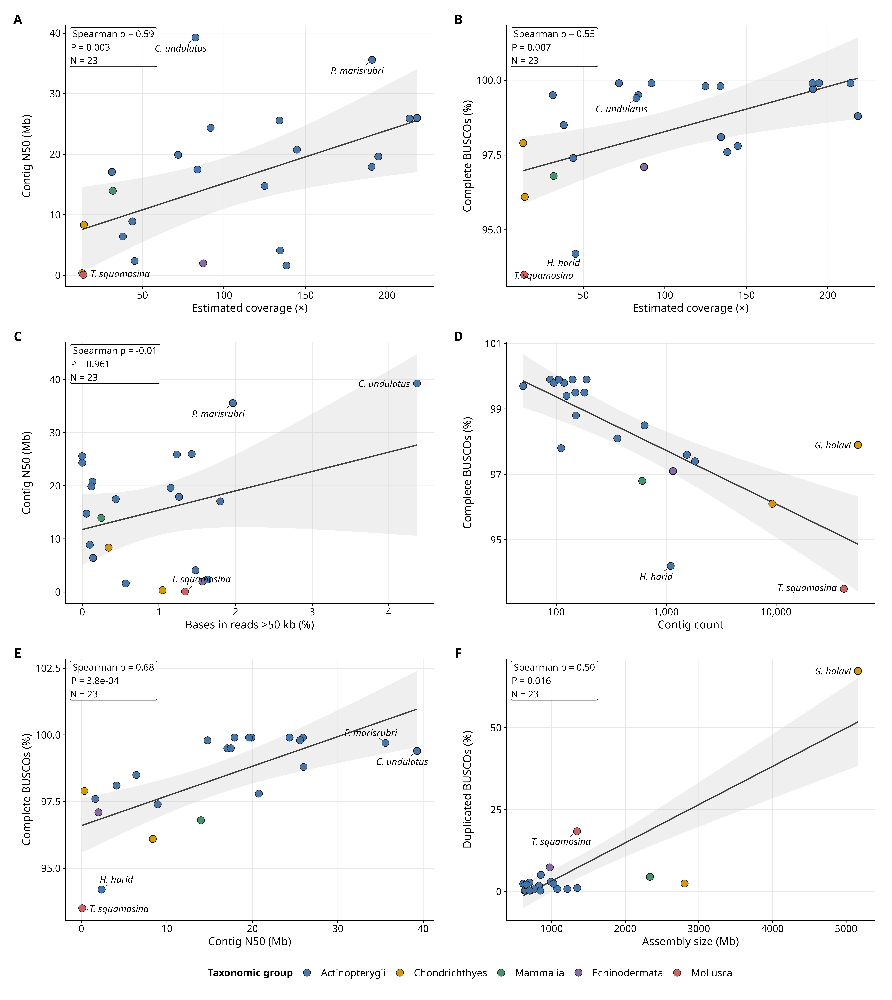
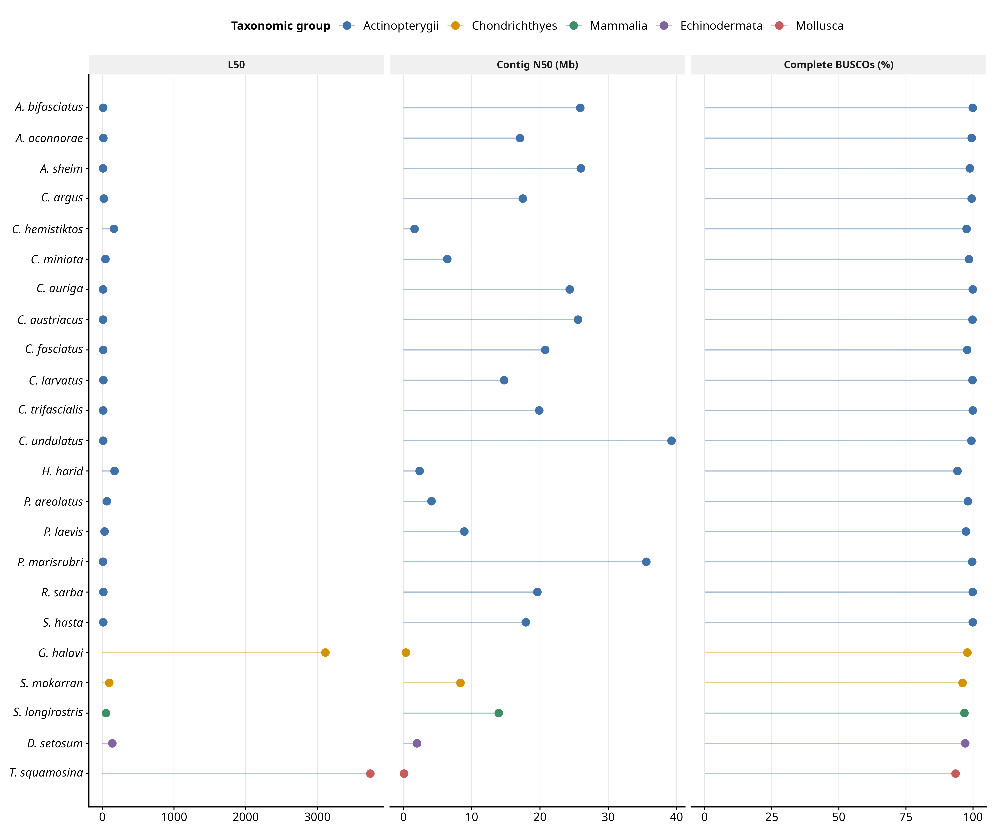
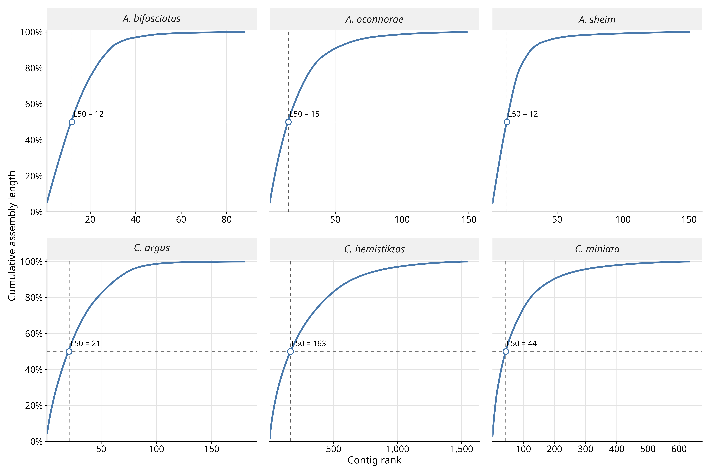
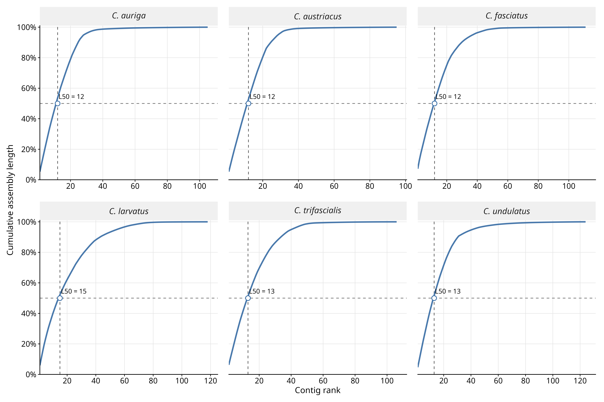
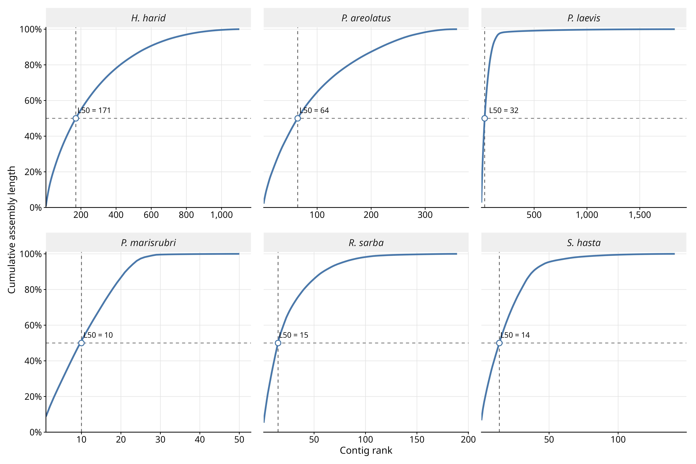
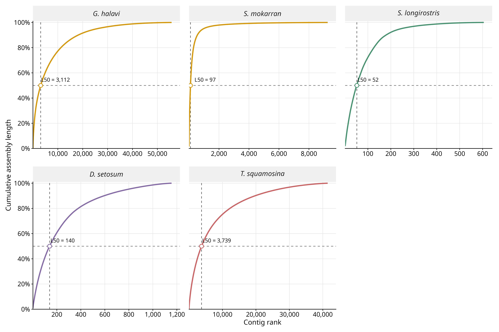
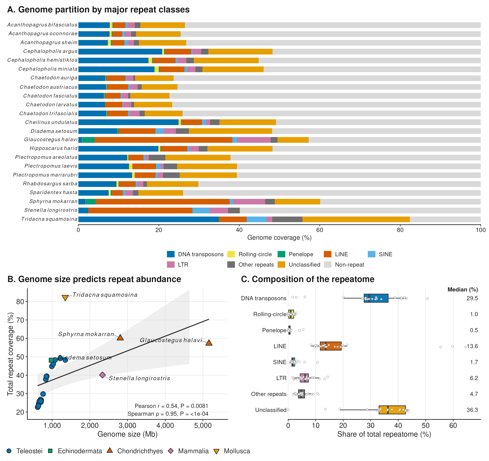

# Genome Assembly/Annotation for Red Sea species generated using Oxford Nanopore Technology longreads

**Last update:** 10 September 2026  
**Analysis and report:** Luiz Cauz dos Santos 

## Table of Contents

- [1. Project context](#1-project-context)
- [2. Sequencing Overview](#2-sequencing-overview)
  - [2.1 Samples](#21-samples)
  - [2.2 DNA Extraction and Library Preparation](#22-dna-extraction-and-library-preparation)
  - [2.3 Sequencing Output](#23-sequencing-output)
- [3. Genome Assembly](#3-genome-assembly)
  - [3.1 Assembly Quality Assessment](#31-assembly-quality-assessment)
  - [3.2 Assembly contiguity assessed from cumulative contig rank](#32-assembly-contiguity-assessed-from-cumulative-contig-rank)
  - [3.3 Snailplot analysis](#33-snailplot-analysis)
- [4. Repeat Annotation of 23 Genome Assemblies with Earl Grey](#4-repeat-annotation-of-23-genome-assemblies-with-earl-grey)
  - [4.1 Workflow overview](#41-workflow-overview)
  - [4.2 Analysis](#42-analysis)
  - [4.3 Repeat annotation and comparative repeat landscape](#43-repeat-annotation-and-comparative-repeat-landscape)
    - [4.3.1 Overall repeat content](#431-overall-repeat-content)
    - [4.3.2 Variation within closely related taxonomic groups](#432-variation-within-closely-related-taxonomic-groups)
    - [4.3.3 Contrasting repeat landscapes among major lineages](#433-contrasting-repeat-landscapes-among-major-lineages)
    - [4.3.4 General patterns](#434-general-patterns)
    - [4.3.5 Output files and reproducibility](#435-output-files-and-reproducibility)
- [5. Structural Gene Annotation](#5-structural-gene-annotation)
  - [5.1 BRAKER3 gene annotation](#51-braker3-gene-annotation)
  - [5.2 Taxon-specific lineage datasets](#52-taxon-specific-lineage-datasets)
  - [5.3 BRAKER3 workflow and principal outputs](#53-braker3-workflow-and-principal-outputs)
  - [5.4 Representative protein datasets](#54-representative-protein-datasets)
  - [5.5 Independent annotation completeness assessment](#55-independent-annotation-completeness-assessment)
  - [5.6 Current annotation status](#56-current-annotation-status)
  - [5.7 Preliminary annotation quality assessment](#57-preliminary-annotation-quality-assessment)
  - [5.8 Analyses in progress](#58-analyses-in-progress)
- [Annexes](#annexes)
  - [A1 - Script used to perform RagTag scaffolding](#a1---script-used-to-perform-ragtag-scaffolding)
  - [A2 - Scripts for Installation and HPC Configuration of Earl Grey 7.2.6](#a2---scripts-for-installation-and-hpc-configuration-of-earl-grey-726)
---

## 1. Project context
This report summarizes the generation and evaluation of 23 draft genome assemblies from marine species associated with the Red Sea and the wider Arabian region. The dataset includes bony fishes, cartilaginous fishes, a marine mammal, an echinoderm, and a mollusc, providing genomic resources across a broad range of ecologically and evolutionarily important lineages.

The genomes were produced to support conservation genomics, evolutionary biology, comparative genomics, repeat annotation, gene annotation, population-genomic analyses, and the development of locally relevant genomic references. Although chromosome-level assemblies are desirable for some applications, they are not always necessary for many conservation and evolutionary analyses. The objective of this project was therefore to generate highly contiguous and gene-complete draft genomes using a cost-effective and scalable Oxford Nanopore Technologies long-read workflow.

All assemblies were generated exclusively from ONT long reads. In most cases, sequencing relied primarily on PromethION flow cells, with MinION flow cells used when appropriate for library testing or supplementary sequencing. The sequencing strategy prioritized long reads and aimed, where possible, to obtain sufficient coverage for robust genome assembly and downstream read-mapping analyses.

The initial workflow included genome assembly, haplotig purging, filtering, assembly-quality assessment, BUSCO completeness evaluation, repeat annotation, gene prediction and functional annotation. **Reference-guided scaffolding was not used to define the final sequence structure because the purpose of the study is to evaluate whether the original ONT contig assemblies are already sufficiently complete and contiguous for conservation and evolutionary applications without introducing reference-dependent joins.**

The current analyses therefore focus on the intrinsic properties of the unscaffolded assemblies. These include total assembly length, number of contigs, contig N50 and N90, auN, longest contig, L50 and L90, GC content, conserved gene-space completeness assessed with BUSCO, support from the original ONT reads, repeat composition, and annotation completeness. Correlations among sequencing yield, estimated coverage, long-read content, contiguity, and BUSCO completeness will be used to evaluate which sequencing characteristics most strongly influenced final assembly quality.

The broader aim is to determine whether a relatively rapid and affordable ONT-only workflow can generate genomes that are “good enough” for practical conservation and evolutionary biology. In this context, “good enough” does not mean chromosome-level or error-free. Instead, it refers to draft genomes that are sufficiently contiguous, complete, and biologically informative for applications such as marker discovery, population read mapping, demographic inference, runs-of-homozygosity analyses, repeat characterization, gene prediction, orthology analysis, and broad comparative genomics.

These 23 assemblies also contribute to reducing the geographic and taxonomic imbalance in publicly available reference genomes. Genomic resources remain disproportionately concentrated in species and research institutions from the Global North, while many biodiversity-rich regions remain underrepresented. Generating locally relevant genomes for Red Sea species can improve read mapping, variant discovery, annotation, and biological interpretation in regional conservation and evolutionary studies.

---

## 2. Sequencing Overview
### 2.1 Samples
Genome sequencing was performed for a taxonomically diverse collection of Red Sea marine organisms, including bony fishes, cartilaginous fishes, a marine mammal, an echinoderm, and a mollusc. Sequencing efforts and sample-processing strategies varied according to sample availability, DNA quality, genome size, project requirements, and the availability of library-preparation materials.

#### Table 1. Sample information for Red Sea species included in the genome sequencing project

| Major taxonomic group | Ecological or taxonomic group | Species | Sex | Project | Sample ID | Record date |
|---|---|---|---|---|---|---|
| Bony fishes | Seabreams | *Acanthopagrus sheim* | Unknown | KAUST | `20241020_P11U2_A_sheim` | 05-Jan-2025 |
| Bony fishes | Seabreams | *Acanthopagrus bifasciatus* | Unknown | KAUST | `A_bifaciatus_ULK114` | 05-Jan-2025 |
| Bony fishes | Seabreams | *Acanthopagrus oconnorae* | Unknown | KAUST | Unknown | 18-Jul-2023 |
| Bony fishes | Coral trout | *Cephalopholis argus* | Unknown | KAUST | `RS5058` | 07-Jan-2025 |
| Bony fishes | Coral trout | *Cephalopholis hemistiktos* | Unknown | KAUST | `RS5917` | 25-Dec-2024 |
| Bony fishes | Coral trout | *Cephalopholis miniata* | Unknown | KAUST | `RS4914` | 13-Sep-2024 |
| Bony fishes | Butterflyfishes | *Chaetodon auriga* | Unknown | KAUST | `5_1D4C` | 01-Sep-2025 |
| Bony fishes | Butterflyfishes | *Chaetodon austriacus* | Unknown | KAUST | `6_1D3A` | 01-Sep-2025 |
| Bony fishes | Butterflyfishes | *Chaetodon fasciatus* | Unknown | KAUST | `A45` | 13-Sep-2024 |
| Bony fishes | Butterflyfishes | *Chaetodon larvatus* | Unknown | KAUST | `A175` | 01-Oct-2024 |
| Bony fishes | Butterflyfishes | *Chaetodon trifascialis* | Unknown | KAUST | `A148` | 12-Oct-2024 |
| Bony fishes | Labridae | *Cheilinus undulatus* | Unknown | KAUST | Unknown | 06-Jun-2024 |
| Echinodermata | Sea urchin | *Diadema setosum* | Unknown | KAUST | Unknown | 24-Aug-2023 |
| Cartilaginous fishes | Elasmobranchs | *Glaucostegus halavi* | Unknown | KAUST | Unknown | 18-Jul-2023 |
| Bony fishes | Labridae | *Hipposcarus harid* | Unknown | KAUST | Unknown | 19-Jul-2023 |
| Bony fishes | Coral trout | *Plectropomus areolatus* | Unknown | KAUST | `20241020_P11U2_P_areolatus` | 07-Jan-2025 |
| Bony fishes | Coral trout | *Plectropomus laevis* | Unknown | KAUST | `RS7335` | 01-Oct-2024 |
| Bony fishes | Coral trout | *Plectropomus marisrubri* | Unknown | KAUST | Unknown | 20-Jul-2023 |
| Bony fishes | Seabreams | *Rhabdosargus sarba* | Unknown | KAUST | `R. sarba` | 05-Jan-2025 |
| Bony fishes | Seabreams | *Sparidentex hasta* | Unknown | KAUST | `S. hasta` | 07-Jan-2025 |
| Cartilaginous fishes | Elasmobranchs | *Sphyrna mokarran* | Unknown | KAUST | Unknown | 18-Jul-2023 |
| Mammalia | Dolphin | *Stenella longirostris* | Unknown | KAUST | `Dolphin_25-03-2021` | 01-Oct-2024 |
| Mollusca | Giant clam | *Tridacna squamosina* | Unknown | KAUST | Unknown | 18-Jul-2023 |

### 2.2 DNA Extraction and Library Preparation

High-molecular-weight genomic DNA was extracted using one of several commercial methods. Spin-column-based extractions included the Qiagen DNeasy Blood & Tissue Kit (catalogue no. 69506) and the New England Biolabs Monarch Genomic DNA Purification Kit (catalogue no. T3010). Bead-based extractions were performed using the Zymo Research Quick-DNA HMW MagBead Kit (catalogue no. D6060).


##### DNA-extraction approaches

- **Spin-column methods**
  - Qiagen DNeasy Blood & Tissue Kit, catalogue no. 69506
  - New England Biolabs Monarch Genomic DNA Purification Kit, catalogue no. T3010
- **Magnetic-bead methods**
  - Zymo Research Quick-DNA HMW MagBead Kit, catalogue no. D6060

Most libraries were prepared without deliberate size selection or fragmentation. Only three assemblies used a fragmentation-based approach during library preparation. For later DNA extractions, an additional bead-clean purification step was performed before library preparation where required to improve sample purity.

DNA quantity and purity were assessed using a Qubit fluorometer and a NanoDrop spectrophotometer or equivalent instruments. DNA-fragment-size distributions were evaluated using an Agilent TapeStation 4200. Quality-control measurements were repeated at different stages of DNA extraction, preprocessing, and library preparation when necessary.

Sequencing libraries were prepared using the ONT Ligation Sequencing Kit V14 (SQK-LSK114), following the PromethION-specific branch of the manufacturer's protocol without modification.

For all assemblies, sequencing efforts were calibrated first to maximize read length and second to obtain a minimum target coverage of approximately 30× where possible. This target was selected because coverage near or above 30× is commonly considered sufficient for recovering most heterozygous sites with adequate depth for downstream remapping, genotyping, and phasing analyses (Fountain et al. 2016).

Because ONT protocols are commonly optimized for human genomic DNA, a combination of MinION and PromethION flow cells was used according to genome size, library performance, and available sequencing capacity. High-output PromethION flow cells provided the majority of sequence data, whereas lower-cost MinION flow cells were used for initial library testing or supplementary sequencing where appropriate.

### 2.3 Sequencing Output

The ONT sequencing datasets varied substantially in total yield. Raw sequencing output ranged from approximately 18.9 Gb for *Tridacna squamosina* to approximately 163.0 Gb for *Plectropomus marisrubri*. Trimming and filtering generally retained most of the raw sequencing yield, although the proportion of sequence represented by reads longer than 50 kb varied widely among samples.

Several datasets contained more than 1 Gb of sequence in reads exceeding 50 kb, including those generated for *Acanthopagrus sheim*, *A. bifasciatus*, *Cheilinus undulatus*, *Diadema setosum*, *Hipposcarus harid*, *Plectropomus areolatus*, *P. marisrubri*, *Rhabdosargus sarba*, and *Sparidentex hasta*. In contrast, several butterflyfish datasets contained very little sequence in reads longer than 50 kb.

#### Table 2. Oxford Nanopore sequencing output for the 23 genome datasets

| Species | Raw input data (bp) | Trimmed input data (bp) | Data retained after trimming (%) | Bases in reads >50 kb | Reads >50 kb (%) |
|---|---:|---:|---:|---:|---:|
| *Acanthopagrus sheim* | 152,286,142,260 | 151,128,586,933 | 99.24 | 2,155,903,437 | 1.426536 |
| *Acanthopagrus bifasciatus* | 152,660,146,764 | 151,883,542,538 | 99.49 | 1,874,143,063 | 1.233934 |
| *Acanthopagrus oconnorae* | 22,293,467,218 | 21,971,200,999 | 98.55 | 395,263,433 | 1.799007 |
| *Cephalopholis argus* | 90,891,656,559 | 90,220,876,255 | 99.26 | 394,023,958 | 0.436733 |
| *Cephalopholis hemistiktos* | 140,677,277,405 | 136,980,767,765 | 97.37 | 777,186,109 | 0.567369 |
| *Cephalopholis miniata* | 39,830,595,948 | 39,131,052,636 | 98.24 | 55,498,115 | 0.141826 |
| *Chaetodon auriga* | 58,445,141,568 | 58,445,130,123 | 100.00 | 54,320 | 0.000093 |
| *Chaetodon austriacus* | 86,443,516,319 | 86,443,510,414 | 100.00 | Not available | 0.000000 |
| *Chaetodon fasciatus* | 89,589,659,619 | 88,917,916,737 | 99.25 | 118,808,024 | 0.133615 |
| *Chaetodon larvatus* | 80,401,306,265 | 79,470,117,495 | 98.84 | 43,927,000 | 0.055275 |
| *Chaetodon trifascialis* | 48,246,784,220 | 47,528,473,894 | 98.51 | 56,162,925 | 0.118167 |
| *Cheilinus undulatus* | 101,424,154,645 | 100,200,067,258 | 98.79 | 4,377,179,065 | 4.368439 |
| *Diadema setosum* | 86,767,562,007 | 85,167,650,170 | 98.16 | 1,334,014,156 | 1.566339 |
| *Glaucostegus halavi* | 69,078,714,971 | 67,922,026,453 | 98.33 | 711,118,010 | 1.046962 |
| *Hipposcarus harid* | 61,832,904,029 | 61,032,613,450 | 98.71 | 994,945,779 | 1.630187 |
| *Plectropomus areolatus* | 113,196,702,974 | 111,738,524,904 | 98.71 | 1,650,817,125 | 1.477393 |
| *Plectropomus laevis* | 37,821,315,929 | 37,461,932,817 | 99.05 | 36,741,004 | 0.098076 |
| *Plectropomus marisrubri* | 162,957,348,858 | 161,402,976,136 | 99.05 | 3,173,506,481 | 1.966201 |
| *Rhabdosargus sarba* | 149,204,669,551 | 147,740,807,247 | 99.02 | 1,701,964,653 | 1.151994 |
| *Sparidentex hasta* | 134,246,258,476 | 133,333,905,856 | 99.32 | 1,682,973,880 | 1.262225 |
| *Sphyrna mokarran* | 40,991,002,802 | 39,832,176,473 | 97.17 | 136,907,972 | 0.343712 |
| *Stenella longirostris* | 74,951,086,910 | 74,363,055,806 | 99.22 | 185,076,757 | 0.248883 |
| *Tridacna squamosina* | 18,929,346,289 | 18,639,084,806 | 98.47 | 249,887,484 | 1.340664 |

---

## 3. Genome Assembly

Genome assemblies were generated from filtered ONT reads using the ONTeater automated assembly workflow and associated long-read assemblers. Final assembly choice was based on contiguity, gene-space completeness, genome-size plausibility, read support, and the absence of obvious contamination or assembly artifacts.

The final genomes analyzed in this study were retained as unscaffolded contig assemblies. Reference-guided scaffolding was not used to order, orient, or join contigs in the assemblies selected for downstream analysis, annotation, or public deposition.


### 3.1 Assembly Quality Assessment

Assembly quality was evaluated using complementary measures of contiguity, sequence composition, and conserved gene-space completeness. All analyses were performed on the final unscaffolded contig assemblies so that the reported statistics reflected the intrinsic quality of the Oxford Nanopore-based assemblies rather than improvements introduced through reference-guided scaffolding.

Assembly contiguity and composition were assessed using QUAST. The principal metrics retained for comparison among species were total assembly length, total number of contigs, length of the largest contig, contig N50, contig N90, L50, L90, auN, and GC content. The N50 and N90 values represent the contig lengths above which 50% and 90% of the total assembly length, respectively, are contained. The corresponding L50 and L90 values indicate the minimum number of contigs required to represent these proportions of the assembly. The auN statistic was additionally included because it summarizes the complete contig-length distribution and is less dependent on a single threshold than N50.

All assemblies consisted exclusively of ungapped contigs and contained no ambiguous bases, resulting in 0.00 Ns per 100 kb across the complete dataset.

Conserved gene-space completeness was assessed using BUSCO in genome mode. The most taxonomically appropriate available lineage dataset was selected for each major group:

- `actinopterygii_odb10` was used for the ray-finned fishes and contained 3,640 conserved orthologues;
- `vertebrata_odb10` was used for the cartilaginous fishes *Glaucostegus halavi* and *Sphyrna mokarran* and contained 3,354 conserved orthologues;
- `mammalia_odb10` was used for *Stenella longirostris* and contained 9,226 conserved orthologues;
- `metazoa_odb10` was used for the echinoderm *Diadema setosum* and the mollusc *Tridacna squamosina* and contained 954 conserved orthologues.

BUSCO results were summarized as the percentages of complete single-copy, complete duplicated, fragmented, and missing orthologues. Because different lineage datasets contain different numbers of BUSCO markers, comparisons among distantly related taxonomic groups were interpreted cautiously. Comparisons were considered most directly informative among species assessed with the same BUSCO lineage.

#### Table 3. Contig-level statistics for the 23 unscaffolded genome assemblies

| Species | Taxonomic group | Assembly size (Mb) | Contigs | Largest contig (Mb) | Contig N50 (Mb) | Contig N90 (Mb) | L50 | L90 | auN (Mb) | GC (%) |
|---|---|---:|---:|---:|---:|---:|---:|---:|---:|---:|
| *Acanthopagrus bifasciatus* | Actinopterygii | 710.16 | 88 | 36.42 | 25.91 | 9.94 | 12 | 29 | 23.27 | 42.02 |
| *Acanthopagrus oconnorae* | Actinopterygii | 700.90 | 149 | 33.87 | 17.08 | 3.22 | 15 | 48 | 16.83 | 42.18 |
| *Acanthopagrus sheim* | Actinopterygii | 691.88 | 151 | 32.18 | 25.99 | 5.43 | 12 | 31 | 22.33 | 42.12 |
| *Cephalopholis argus* | Actinopterygii | 1,077.90 | 180 | 46.95 | 17.48 | 5.38 | 21 | 64 | 19.43 | 40.73 |
| *Cephalopholis hemistiktos* | Actinopterygii | 990.50 | 1,546 | 14.45 | 1.62 | 0.35 | 163 | 647 | 2.39 | 41.16 |
| *Cephalopholis miniata* | Actinopterygii | 1,027.59 | 636 | 26.09 | 6.42 | 0.94 | 44 | 197 | 8.60 | 41.05 |
| *Chaetodon auriga* | Actinopterygii | 636.64 | 105 | 33.68 | 24.36 | 13.45 | 12 | 25 | 22.82 | 42.72 |
| *Chaetodon austriacus* | Actinopterygii | 644.62 | 95 | 34.13 | 25.58 | 9.27 | 12 | 25 | 23.27 | 42.49 |
| *Chaetodon fasciatus* | Actinopterygii | 614.45 | 111 | 44.16 | 20.76 | 6.25 | 12 | 30 | 20.44 | 42.71 |
| *Chaetodon larvatus* | Actinopterygii | 636.06 | 118 | 37.66 | 14.75 | 3.84 | 15 | 43 | 16.35 | 42.86 |
| *Chaetodon trifascialis* | Actinopterygii | 661.24 | 106 | 41.30 | 19.90 | 6.46 | 13 | 34 | 19.65 | 42.85 |
| *Cheilinus undulatus* | Actinopterygii | 1,213.97 | 124 | 56.66 | 39.28 | 13.47 | 13 | 31 | 36.75 | 39.57 |
| *Diadema setosum* | Echinodermata | 976.22 | 1,156 | 9.85 | 1.98 | 0.32 | 140 | 594 | 2.50 | 38.31 |
| *Glaucostegus halavi* | Chondrichthyes | 5,160.97 | 55,706 | 7.71 | 0.35 | 0.05 | 3,112 | 18,187 | 0.77 | 42.38 |
| *Hipposcarus harid* | Actinopterygii | 1,349.00 | 1,101 | 10.29 | 2.36 | 0.64 | 171 | 586 | 2.97 | 39.68 |
| *Plectropomus areolatus* | Actinopterygii | 831.05 | 359 | 17.84 | 4.11 | 1.19 | 64 | 218 | 4.87 | 39.45 |
| *Plectropomus laevis* | Actinopterygii | 854.80 | 1,831 | 23.44 | 8.91 | 2.03 | 32 | 107 | 9.41 | 39.38 |
| *Plectropomus marisrubri* | Actinopterygii | 845.90 | 50 | 74.12 | 35.58 | 20.12 | 10 | 22 | 36.47 | 39.41 |
| *Rhabdosargus sarba* | Actinopterygii | 758.96 | 189 | 40.01 | 19.62 | 2.83 | 15 | 59 | 17.08 | 41.80 |
| *Sparidentex hasta* | Actinopterygii | 699.72 | 141 | 46.51 | 17.92 | 5.38 | 14 | 39 | 19.17 | 42.10 |
| *Sphyrna mokarran* | Chondrichthyes | 2,807.42 | 9,250 | 43.28 | 8.35 | 0.61 | 97 | 555 | 10.38 | 42.53 |
| *Stenella longirostris* | Mammalia | 2,335.09 | 605 | 43.13 | 13.97 | 2.66 | 52 | 180 | 16.13 | 41.31 |
| *Tridacna squamosina* | Mollusca | 1,346.22 | 41,454 | 1.39 | 0.09 | 0.01 | 3,739 | 19,727 | 0.14 | 36.24 |


#### Table 4. BUSCO assessment of conserved gene-space completeness in the 23 unscaffolded genome assemblies

| Species | BUSCO lineage | Complete (%) | Single-copy (%) | Duplicated (%) | Fragmented (%) | Missing (%) | BUSCOs assessed |
|---|---|---:|---:|---:|---:|---:|---:|
| *Acanthopagrus bifasciatus* | actinopterygii_odb10 | 99.9 | 99.6 | 0.3 | 0.0 | 0.1 | 3,640 |
| *Acanthopagrus oconnorae* | actinopterygii_odb10 | 99.5 | 96.6 | 2.8 | 0.0 | 0.5 | 3,640 |
| *Acanthopagrus sheim* | actinopterygii_odb10 | 98.8 | 98.4 | 0.4 | 0.1 | 1.2 | 3,640 |
| *Cephalopholis argus* | actinopterygii_odb10 | 99.5 | 98.7 | 0.8 | 0.1 | 0.4 | 3,640 |
| *Cephalopholis hemistiktos* | actinopterygii_odb10 | 97.6 | 94.6 | 3.0 | 0.4 | 2.0 | 3,640 |
| *Cephalopholis miniata* | actinopterygii_odb10 | 98.5 | 96.0 | 2.4 | 0.2 | 1.3 | 3,640 |
| *Chaetodon auriga* | actinopterygii_odb10 | 99.9 | 99.5 | 0.3 | 0.0 | 0.1 | 3,640 |
| *Chaetodon austriacus* | actinopterygii_odb10 | 99.8 | 99.5 | 0.4 | 0.0 | 0.1 | 3,640 |
| *Chaetodon fasciatus* | actinopterygii_odb10 | 97.8 | 95.3 | 2.4 | 0.1 | 2.2 | 3,640 |
| *Chaetodon larvatus* | actinopterygii_odb10 | 99.8 | 97.7 | 2.1 | 0.0 | 0.2 | 3,640 |
| *Chaetodon trifascialis* | actinopterygii_odb10 | 99.9 | 97.7 | 2.1 | 0.0 | 0.1 | 3,640 |
| *Cheilinus undulatus* | actinopterygii_odb10 | 99.4 | 98.6 | 0.8 | 0.1 | 0.5 | 3,640 |
| *Diadema setosum* | metazoa_odb10 | 97.1 | 89.6 | 7.4 | 0.7 | 2.2 | 954 |
| *Glaucostegus halavi* | vertebrata_odb10 | 97.9 | 30.6 | 67.3 | 1.1 | 1.0 | 3,354 |
| *Hipposcarus harid* | actinopterygii_odb10 | 94.2 | 93.1 | 1.1 | 0.5 | 5.2 | 3,640 |
| *Plectropomus areolatus* | actinopterygii_odb10 | 98.1 | 96.3 | 1.8 | 0.2 | 1.7 | 3,640 |
| *Plectropomus laevis* | actinopterygii_odb10 | 97.4 | 92.3 | 5.1 | 0.1 | 2.4 | 3,640 |
| *Plectropomus marisrubri* | actinopterygii_odb10 | 99.7 | 99.4 | 0.3 | 0.0 | 0.3 | 3,640 |
| *Rhabdosargus sarba* | actinopterygii_odb10 | 99.9 | 99.1 | 0.7 | 0.0 | 0.1 | 3,640 |
| *Sparidentex hasta* | actinopterygii_odb10 | 99.9 | 99.6 | 0.3 | 0.0 | 0.1 | 3,640 |
| *Sphyrna mokarran* | vertebrata_odb10 | 96.1 | 93.6 | 2.5 | 1.2 | 2.7 | 3,354 |
| *Stenella longirostris* | mammalia_odb10 | 96.8 | 92.4 | 4.5 | 0.4 | 2.8 | 9,226 |
| *Tridacna squamosina* | metazoa_odb10 | 93.5 | 75.1 | 18.4 | 2.8 | 3.7 | 954 |

Overall, the unscaffolded assemblies varied substantially in contiguity, but most recovered highly complete representations of conserved gene space. Among the ray-finned fishes, several assemblies combined low contig counts, large contig N50 values, and BUSCO completeness above 99%. Particularly contiguous assemblies included *Cheilinus undulatus*, *Plectropomus marisrubri*, *Acanthopagrus bifasciatus*, *A. sheim*, *Chaetodon auriga*, and *C. austriacus*. These genomes had contig N50 values between approximately 24 and 39 Mb and were represented by fewer than 151 contigs.

Several more fragmented assemblies nevertheless retained high BUSCO completeness. For example, *Cephalopholis hemistiktos* had a contig N50 of 1.62 Mb and 1,546 contigs but recovered 97.6% of the expected actinopterygian BUSCOs. Similarly, *Diadema setosum* had a contig N50 of 1.98 Mb but recovered 97.1% of metazoan BUSCOs. These results indicate that reduced structural contiguity did not necessarily correspond to severe loss of conserved gene content.

The *Glaucostegus halavi* assembly was highly fragmented and unusually large, with a total length of 5.16 Gb and 55,706 contigs. Although BUSCO completeness was high at 97.9%, 67.3% of BUSCOs were duplicated. This extreme duplication, together with the large assembly size, is consistent with extensive retention of alternative haplotypes or other redundant sequence and indicates that further haplotig purging or assembly curation is required before the genome can be treated as a haploid reference assembly.

The *Sphyrna mokarran* assembly was also relatively fragmented, with 9,250 contigs, but showed a substantially higher contig N50 of 8.35 Mb and a more conventional BUSCO duplication level of 2.5%. Its 96.1% complete BUSCO score suggests that the assembly recovered most conserved vertebrate gene content despite the presence of numerous short contigs.

The *Tridacna squamosina* assembly was the most structurally fragmented assembly retained in the dataset, with 41,454 contigs and a contig N50 of only 91.3 kb. Nevertheless, it recovered 93.5% of the metazoan BUSCO set. The duplicated BUSCO proportion of 18.4% may reflect retained haplotypes, genuine gene duplication, or limitations associated with the broad `metazoa_odb10` lineage. This genome may therefore remain useful for gene-content and repeat analyses but should be used cautiously for analyses requiring long-range structural continuity.

Taken together, the results show that most ONT-only contig assemblies recovered highly complete conserved gene sets and, in many cases, achieved megabase-scale contiguity without reference-guided scaffolding. However, some assemblies still require additional investigation or curation, particularly *Glaucostegus halavi* because of its extreme duplication and unusually large assembly size, and *Tridacna squamosina* because of its substantial fragmentation and elevated BUSCO duplication.


**Figure 1. Conserved gene-space completeness of the unscaffolded ONT genome assemblies.** BUSCO results are shown as the percentages of complete single-copy, complete duplicated, fragmented, and missing orthologues for each assembly. Species are ordered by major taxonomic group and then alphabetically within groups. Ray-finned fishes were assessed with `actinopterygii_odb10`, cartilaginous fishes with `vertebrata_odb10`, *Stenella longirostris* with `mammalia_odb10`, and *Diadema setosum* and *Tridacna squamosina* with `metazoa_odb10`. Because the BUSCO lineage datasets differ in taxonomic scope and number of markers, direct comparisons are most informative among species evaluated with the same lineage. Most assemblies recovered high proportions of complete BUSCOs, although elevated duplication was observed in *Glaucostegus halavi* and, to a lesser extent, *Tridacna squamosina*.


**Figure 2. Relationships among sequencing effort, assembly contiguity, and conserved gene-space completeness.** Scatterplots show: **(A)** estimated sequencing coverage versus contig N50; **(B)** estimated sequencing coverage versus complete BUSCO percentage; **(C)** percentage of bases contained in reads longer than 50 kb versus contig N50; **(D)** contig count versus complete BUSCO percentage; **(E)** contig N50 versus complete BUSCO percentage; and **(F)** total assembly size versus duplicated BUSCO percentage. Points are coloured by major taxonomic group. Solid black lines show linear regressions with 95% confidence intervals and are included as visual summaries, whereas the reported statistics correspond to Spearman rank correlations. Selected species are labelled to highlight notable assemblies and outliers. The contig-count axis in panel D is log-transformed.


**Figure S1. Comparative overview of assembly contiguity and conserved gene-space completeness.** L50, contig N50, and complete BUSCO percentage are shown for each unscaffolded genome assembly. Species are ordered by major taxonomic group and then alphabetically within groups, with points and connecting lines coloured by taxonomic group. Lower L50 values and higher contig N50 values indicate greater assembly contiguity, whereas higher complete BUSCO percentages indicate more complete recovery of conserved gene space. Together, these metrics illustrate that many assemblies achieved high gene-space completeness despite substantial variation in contiguity.

### 3.2 Assembly contiguity assessed from cumulative contig rank

Cumulative contig-length curves were generated for all 23 unscaffolded ONT genome assemblies. For each species, contigs were ordered from longest to shortest and the cumulative proportion of total assembly length was calculated across contig rank. The dashed horizontal line marks 50% of the assembly, while the dashed vertical line and labelled point indicate the corresponding L50 value. Lower L50 values indicate that a smaller number of contigs accounts for half of the assembly and therefore reflect greater assembly contiguity.

Most actinopterygian assemblies were highly contiguous, with half of the assembled genome represented by fewer than approximately 20 contigs in many species. Particularly low L50 values were observed for *Plectropomus marisrubri* (L50 = 10), several *Acanthopagrus* and *Chaetodon* assemblies (L50 = 12–15), *Cheilinus undulatus* (L50 = 13), and *Sparidentex hasta* (L50 = 14). In contrast, *Cephalopholis hemistiktos* (L50 = 163), *Hipposcarus harid* (L50 = 171), and *Plectropomus areolatus* (L50 = 64) required more contigs to represent 50% of their assemblies.

Greater variation was observed among the non-actinopterygian taxa. *Stenella longirostris* showed relatively high contiguity with L50 = 52, while *Sphyrna mokarran* and *Diadema setosum* had intermediate values of 97 and 140, respectively. The most fragmented assemblies were *Glaucostegus halavi* and *Tridacna squamosina*, for which 3,112 and 3,739 contigs, respectively, were required to account for half of the total assembly length. These results are consistent with the N50 and overall contiguity comparisons and highlight substantial differences in assembly structure among taxa.




**Figure S2A. Cumulative contig-length distributions for the first group of actinopterygian assemblies.** Panels show *Acanthopagrus bifasciatus*, *Acanthopagrus oconnorae*, *Acanthopagrus sheim*, *Cephalopholis argus*, *Cephalopholis hemistiktos*, and *Cephalopholis miniata*. Contigs were ranked from longest to shortest, and the cumulative percentage of total assembly length was calculated. Dashed horizontal and vertical lines indicate 50% cumulative assembly length and the corresponding L50 value, respectively.




**Figure S2B. Cumulative contig-length distributions for the second group of actinopterygian assemblies.** Panels show *Chaetodon auriga*, *Chaetodon austriacus*, *Chaetodon fasciatus*, *Chaetodon larvatus*, *Chaetodon trifascialis*, and *Cheilinus undulatus*. Curves and L50 annotations are presented as described for Figure S2A.




**Figure S2C. Cumulative contig-length distributions for the third group of actinopterygian assemblies.** Panels show *Hipposcarus harid*, *Plectropomus areolatus*, *Plectropomus laevis*, *Plectropomus marisrubri*, *Rhabdosargus sarba*, and *Sparidentex hasta*. Curves and L50 annotations are presented as described for Figure S2A.




**Figure S2D. Cumulative contig-length distributions for the non-actinopterygian assemblies.** Panels show *Glaucostegus halavi*, *Sphyrna mokarran*, *Stenella longirostris*, *Diadema setosum*, and *Tridacna squamosina*. Lower L50 values indicate greater contiguity, whereas the shallower curves and high L50 values for *G. halavi* and *T. squamosina* reflect substantially more fragmented assemblies.

### 3.3 Snailplot analysis

BlobToolKit snailplots were generated for the 23 final unscaffolded ONT genome assemblies using the corresponding assembly FASTA files and BUSCO results. Species were divided into four taxonomically organized supplementary figures. The plots summarize assembly size, contig-length distribution, GC-content distribution, contig N50 and N90, and BUSCO completeness.

Overall, most ray-finned fish assemblies displayed compact contig distributions, relatively high contig N50 values, and high conserved gene-space completeness. Greater fragmentation was evident for some assemblies, particularly *Glaucostegus halavi* and *Tridacna squamosina*, consistent with their higher L50 and lower contiguity metrics. The snailplots therefore support the broader quantitative comparisons while also showing the complete contig-size and GC-content distributions of each assembly.


**Figure S3A. BlobToolKit snailplots for the first group of Actinopterygii genome assemblies.** Panels show **(A)** *Acanthopagrus bifasciatus*, **(B)** *Acanthopagrus oconnorae*, **(C)** *Acanthopagrus sheim*, **(D)** *Cephalopholis argus*, **(E)** *Cephalopholis hemistiktos*, and **(F)** *Cephalopholis miniata*. Each snailplot summarizes assembly size, ranked contig-length distribution, GC composition, contig N50 and N90, and BUSCO completeness.


**Figure S3B. BlobToolKit snailplots for the second group of Actinopterygii genome assemblies.** Panels show **(A)** *Chaetodon auriga*, **(B)** *Chaetodon austriacus*, **(C)** *Chaetodon fasciatus*, **(D)** *Chaetodon larvatus*, **(E)** *Chaetodon trifascialis*, and **(F)** *Cheilinus undulatus*. Plot components are as described for Figure S3A.


**Figure S3C. BlobToolKit snailplots for the third group of Actinopterygii genome assemblies.** Panels show **(A)** *Hipposcarus harid*, **(B)** *Plectropomus areolatus*, **(C)** *Plectropomus laevis*, **(D)** *Plectropomus marisrubri*, **(E)** *Rhabdosargus sarba*, and **(F)** *Sparidentex hasta*. Plot components are as described for Figure S3A.


**Figure S3D. BlobToolKit snailplots for the non-actinopterygian genome assemblies.** Panels show **(A)** *Glaucostegus halavi*, **(B)** *Sphyrna mokarran*, **(C)** *Stenella longirostris*, **(D)** *Diadema setosum*, and **(E)** *Tridacna squamosina*. Each plot summarizes assembly size, ranked contig-length distribution, GC composition, contig N50 and N90, and BUSCO completeness. Snailplots are scaled independently according to the size and composition of each assembly.

---

## 4. Repeat Annotation of 23 Genome Assemblies with Earl Grey
### 4.1 Workflow overview
This workflow performs de novo repeat discovery, repeat-family classification, genome-wide repeat annotation, and soft masking for 24 genome assemblies using Earl Grey on a SLURM-managed HPC cluster.

Each genome is processed independently through a SLURM job array. Species-specific working directories prevent collisions between temporary files, RepeatModeler databases, RepeatMasker outputs, and Earl Grey checkpoints.

#### Software and repeat libraries:
| Component | Version |
|---|---:|
| Earl Grey | 7.2.6 |
| RepeatModeler | 2.0.7 |
| RepeatMasker | 4.2.3 |
| RMBlast | 2.14.1+ |
| Dfam | 3.9 |
| FamDB file format | 2.0.0 |

The following Dfam 3.9 partitions were installed:

| Partition | Main taxonomic coverage |
|---:|---|
| 0 | Root partition and broadly distributed repeat families |
| 2 | Archelosauria, including birds |
| 4 | Otomorpha |
| 5 | Rosids |
| 6 | Other Viridiplantae lineages |
| 7 | Mammalia |
| 10 | Eupercaria |
| 12 | Other vertebrates, including Chondrichthyes |
| 15 | Protostomia, including Spiralia |
| 16 | Echinodermata, fungi, protists, viruses, and additional lineages |

Earl Grey was run without `-r`. Consequently, no taxon-specific pre-masking was performed before de novo repeat discovery. The installed Dfam partitions remained available for repeat classification and downstream RepeatMasker steps.

#### Genome assemblies used:
| Array task | Analysis identifier | Input assembly |
|---:|---|---|
| 1 | `Acanthopagrus_bifasciatus` | `Acanthopagrus_bifasciatus_nextDenovo_major_merged_purged_FILT_SORT.fa.gz` |
| 2 | `Acanthopagrus_oconnorae` | `Acanthopagrus_oconnorae_nextDenovo_major_merge_purged_FILT_SORT.fa.gz` |
| 3 | `Acanthopagrus_sheim` | `Acanthopagrus_sheim_ONT_nextDenovo_major_merged_purged_FILT_SORT.fa.gz` |
| 4 | `Cephalopholis_argus` | `Cephalopholis_argus_nextDenovo_major_merged_purged_FILT_SORT.fa.gz` |
| 5 | `Cephalopholis_hemistiktos` | `Cephalopholis_hemistiktos_2_nextDenovo_major_merged_purged_FILT_SORT.fa.gz` |
| 6 | `Cephalopholis_miniata` | `Cephalopholis_miniata_nextDenovo_major_FILT_SORT.fa.gz` |
| 7 | `Chaetodon_auriga` | `Chaetodon_auriga_5_1D4C_ONT_merged_purged_FILT_SORT.fa.gz` |
| 8 | `Chaetodon_austriacus` | `Chaetodon_austriacus_6_1D3A_ONT_merged_purged_FILT_SORT.fa.gz` |
| 9 | `Chaetodon_fasciatus` | `Chaetodon_fasciatus_nextDenovo_major_FILT_SORT.fa.gz` |
| 10 | `Chaetodon_larvatus` | `Chaetodon_larvatus_nextDenovo_major_FILT_SORT.fa.gz` |
| 11 | `Chaetodon_trifascialis` | `Chaetodon_trifascialis_nextDenovo_major_merged_purged_FILT_SORT.fa.gz` |
| 12 | `Cheilinus_undulatus` | `Cheilinus_undulatus_nextDenovo_major_merged_purged_FILT_SORT.fa.gz` |
| 13 | `Diadema_setosum` | `Diadema_setosum_nextDenovo_major_merge.purged_FILT_SORT.fa.gz` |
| 14 | `Halavi_guitarfish` | `Halavi_guitarfish_FILT_SORT.fa.gz` |
| 15 | `Hipposcarus_harid` | `Hipposcarus_harid_nextDenovo_major_purged_FILT_SORT.fa.gz` |
| 16 | `Plectropomus_areolatus` | `Plectropomus_areolatus_nextDenovo_major_merged_purged_FILT_SORT.fa.gz` |
| 17 | `Plectropomus_laevis` | `Plectropomus_laevis_Flye_major_FILT_SORT.fa.gz` |
| 18 | `Plectropomus_marisrubri` | `Plectropomus_marisrubri_nextDenovo_major_merge.purged_FILT_SORT.fa.gz` |
| 19 | `Rhabdosargus_sarba` | `Rhabdosargus_sarba_ONT_nextDenovo_major_merged_purged_FILT_SORT.fa.gz` |
| 20 | `Sparidentex_hasta` | `Sparidentex_hasta_nextDenovo_major_merged_purged_FILT_SORT.fa.gz` |
| 21 | `Sphyrna_mokarran` | `Sphyrna_mokarran_flye_major_merge.purged_FILT_SORT.fa.gz` |
| 22 | `Stenella_longirostris` | `Stenella_longirostris_nextDenovo_major_FILT_SORT.fa.gz` |
| 23 | `Tridacna_squamosina` | `Tridacna_squamosina_flye_racon_FILT_SORT.fa.gz` |

#### Create genome metadata file:
```bash
BASE=/lisc/data/scratch/botany/cauz/Genome_Annotation/repeats
REFDIR="$BASE/references/KAUST_tmp_assemblies"
WORK="$BASE/earlgrey_KAUST_parallel"

mkdir -p "$WORK"/{logs,results,scripts}

cat > "$WORK/genomes.tsv" <<EOF2
$REFDIR/Acanthopagrus_bifasciatus_nextDenovo_major_merged_purged_FILT_SORT.fa.gz	Acanthopagrus_bifasciatus
$REFDIR/Acanthopagrus_oconnorae_nextDenovo_major_merge_purged_FILT_SORT.fa.gz	Acanthopagrus_oconnorae
$REFDIR/Acanthopagrus_sheim_ONT_nextDenovo_major_merged_purged_FILT_SORT.fa.gz	Acanthopagrus_sheim
$REFDIR/Cephalopholis_argus_nextDenovo_major_merged_purged_FILT_SORT.fa.gz	Cephalopholis_argus
$REFDIR/Cephalopholis_hemistiktos_2_nextDenovo_major_merged_purged_FILT_SORT.fa.gz	Cephalopholis_hemistiktos
$REFDIR/Cephalopholis_miniata_nextDenovo_major_FILT_SORT.fa.gz	Cephalopholis_miniata
$REFDIR/Chaetodon_auriga_5_1D4C_ONT_merged_purged_FILT_SORT.fa.gz	Chaetodon_auriga
$REFDIR/Chaetodon_austriacus_6_1D3A_ONT_merged_purged_FILT_SORT.fa.gz	Chaetodon_austriacus
$REFDIR/Chaetodon_fasciatus_nextDenovo_major_FILT_SORT.fa.gz	Chaetodon_fasciatus
$REFDIR/Chaetodon_larvatus_nextDenovo_major_FILT_SORT.fa.gz	Chaetodon_larvatus
$REFDIR/Chaetodon_lineolatus_5_1D3C_ONT_nextDenovo_major_merged.purged_FILT_SORT.fa.gz	Chaetodon_lineolatus
$REFDIR/Chaetodon_trifascialis_nextDenovo_major_merged_purged_FILT_SORT.fa.gz	Chaetodon_trifascialis
$REFDIR/Cheilinus_undulatus_nextDenovo_major_merged_purged_FILT_SORT.fa.gz	Cheilinus_undulatus
$REFDIR/Diadema_setosum_nextDenovo_major_merge.purged_FILT_SORT.fa.gz	Diadema_setosum
$REFDIR/Halavi_guitarfish_FILT_SORT.fa.gz	Halavi_guitarfish
$REFDIR/Hipposcarus_harid_nextDenovo_major_purged_FILT_SORT.fa.gz	Hipposcarus_harid
$REFDIR/Plectropomus_areolatus_nextDenovo_major_merged_purged_FILT_SORT.fa.gz	Plectropomus_areolatus
$REFDIR/Plectropomus_laevis_Flye_major_FILT_SORT.fa.gz	Plectropomus_laevis
$REFDIR/Plectropomus_marisrubri_nextDenovo_major_merge.purged_FILT_SORT.fa.gz	Plectropomus_marisrubri
$REFDIR/Rhabdosargus_sarba_ONT_nextDenovo_major_merged_purged_FILT_SORT.fa.gz	Rhabdosargus_sarba
$REFDIR/Sparidentex_hasta_nextDenovo_major_merged_purged_FILT_SORT.fa.gz	Sparidentex_hasta
$REFDIR/Sphyrna_mokarran_flye_major_merge.purged_FILT_SORT.fa.gz	Sphyrna_mokarran
$REFDIR/Stenella_longirostris_nextDenovo_major_FILT_SORT.fa.gz	Stenella_longirostris
$REFDIR/Tridacna_squamosina_flye_racon_FILT_SORT.fa.gz	Tridacna_squamosina
EOF2
```

Validate the file:

```bash
wc -l "$WORK/genomes.tsv"

while IFS=$'\t' read -r genome species
do
    if [[ -s "$genome" ]]
    then
        echo "OK      $species"
    else
        echo "MISSING $species : $genome"
    fi
done < "$WORK/genomes.tsv"
```

The expected number of entries is `24`.

### 4.2 Analysis
The following script was used for job submission `earlgrey_KAUST_parallel/scripts/run_earlgrey_array.sbatch`:

```bash
#!/usr/bin/env bash
#SBATCH --job-name=EarlGrey
#SBATCH --cpus-per-task=16
#SBATCH --mem=96G
#SBATCH --time=7-00:00:00
#SBATCH --output=/lisc/data/scratch/botany/cauz/Genome_Annotation/repeats/earlgrey_KAUST_parallel/logs/%x_%A_%a.out
#SBATCH --error=/lisc/data/scratch/botany/cauz/Genome_Annotation/repeats/earlgrey_KAUST_parallel/logs/%x_%A_%a.err

set -euo pipefail

module load Conda

ENV=/lisc/data/scratch/botany/cauz/Genome_Annotation/repeats/software/conda_envs/earlgrey-7.2.6
WORK=/lisc/data/scratch/botany/cauz/Genome_Annotation/repeats/earlgrey_KAUST_parallel
MANIFEST="$WORK/genomes.tsv"
RESULTS="$WORK/results"

source "$(conda info --base)/etc/profile.d/conda.sh"
conda activate "$ENV"

export PATH="$ENV/bin:$PATH"
export OPENBLAS_NUM_THREADS=1
export OMP_NUM_THREADS=1
export MKL_NUM_THREADS=1
export NUMEXPR_NUM_THREADS=1

LINE_NUMBER=$((SLURM_ARRAY_TASK_ID + 1))
LINE=$(sed -n "${LINE_NUMBER}p" "$MANIFEST")

if [[ -z "$LINE" ]]
then
    echo "ERROR: no manifest entry for array task ${SLURM_ARRAY_TASK_ID}" >&2
    exit 1
fi

IFS=$'\t' read -r GENOME_GZ SPECIES <<< "$LINE"

if [[ ! -s "$GENOME_GZ" ]]
then
    echo "ERROR: missing or empty genome: $GENOME_GZ" >&2
    exit 1
fi

SPECIES_DIR="$RESULTS/$SPECIES"
INPUT_DIR="$SPECIES_DIR/input"
OUTPUT_DIR="$SPECIES_DIR/earlgrey"
TMP_DIR="$SPECIES_DIR/tmp"
DONE_FILE="$SPECIES_DIR/EARLGREY_COMPLETED.txt"

mkdir -p "$INPUT_DIR" "$OUTPUT_DIR" "$TMP_DIR"

GENOME_FA="$INPUT_DIR/${SPECIES}.fa"
TEMP_FASTA="$INPUT_DIR/${SPECIES}.fa.tmp.${SLURM_JOB_ID}"
export TMPDIR="$TMP_DIR"

echo "============================================================"
echo "SLURM array job:  ${SLURM_ARRAY_JOB_ID}"
echo "SLURM task:       ${SLURM_ARRAY_TASK_ID}"
echo "SLURM job ID:     ${SLURM_JOB_ID}"
echo "Species:          ${SPECIES}"
echo "Compressed input: ${GENOME_GZ}"
echo "Working FASTA:    ${GENOME_FA}"
echo "Output:           ${OUTPUT_DIR}"
echo "CPUs:             ${SLURM_CPUS_PER_TASK}"
echo "Node:             $(hostname)"
echo "Start:            $(date)"
echo "============================================================"

if [[ -s "$DONE_FILE" ]]
then
    echo "Analysis already completed:"
    cat "$DONE_FILE"
    exit 0
fi

if [[ ! -s "$GENOME_FA" ]]
then
    gzip -t "$GENOME_GZ"
    rm -f "$TEMP_FASTA"
    gzip -dc "$GENOME_GZ" > "$TEMP_FASTA"

    if [[ ! -s "$TEMP_FASTA" ]]
    then
        echo "ERROR: decompressed FASTA is empty." >&2
        rm -f "$TEMP_FASTA"
        exit 1
    fi

    if ! head -n 1 "$TEMP_FASTA" | grep -q '^>'
    then
        echo "ERROR: decompressed file does not appear to be FASTA." >&2
        rm -f "$TEMP_FASTA"
        exit 1
    fi

    mv "$TEMP_FASTA" "$GENOME_FA"
else
    echo "Working FASTA already exists; decompression skipped."
fi

ls -lh "$GENOME_FA"
echo "Number of sequences: $(grep -c '^>' "$GENOME_FA")"

earlGrey \
    -g "$GENOME_FA" \
    -s "$SPECIES" \
    -o "$OUTPUT_DIR" \
    -t "$SLURM_CPUS_PER_TASK" \
    -q yes \
    -d yes

{
    echo "Species: $SPECIES"
    echo "Genome: $GENOME_GZ"
    echo "Earl Grey: 7.2.6"
    echo "RepeatMasker: 4.2.3"
    echo "RepeatModeler: 2.0.7"
    echo "RMBlast: 2.14.1+"
    echo "Dfam: 3.9"
    echo "SLURM job: $SLURM_JOB_ID"
    echo "Completed: $(date)"
} > "$DONE_FILE"
```

Make the script executable:

```bash
chmod +x "$WORK/scripts/run_earlgrey_array.sbatch"
```

#### Earl Grey command and parameters:

```bash
earlGrey \
    -g "$GENOME_FA" \
    -s "$SPECIES" \
    -o "$OUTPUT_DIR" \
    -t "$SLURM_CPUS_PER_TASK" \
    -q yes \
    -d yes
```

| Option | Function |
|---|---|
| `-g` | Input genome in FASTA format |
| `-s` | Species or analysis identifier |
| `-o` | Output directory |
| `-t` | Number of threads |
| `-q yes` | Suppress the TEstrainer progress bar in batch logs |
| `-d yes` | Generate a soft-masked genome |


#### Submit all genomes in parallel:

If no validation task is already running:

```bash
cd "$WORK"

ARRAY_JOB=$(sbatch \
    --parsable \
    --array=0-23 \
    scripts/run_earlgrey_array.sbatch)

echo "SLURM array submitted: $ARRAY_JOB"
```

If task 0 is already running:

```bash
ARRAY_JOB=$(sbatch \
    --parsable \
    --array=1-23 \
    scripts/run_earlgrey_array.sbatch)
```

All tasks are submitted immediately. The number that starts at the same time is determined by SLURM resource availability and cluster scheduling policies.

Each task requests 16 CPUs, 96 GB RAM, and seven days of wall time.


## 4.3 Repeat annotation and comparative repeat landscape

Repeat annotation was completed successfully for **all 23 genome assemblies** using Earl Grey 7.2.6. Only final species-level outputs generated after successful completion of the full Earl Grey workflow were used for the comparative analysis.

For each genome, repeat statistics were extracted from:

```text
<species>_summaryFiles/<species>.highLevelCount.txt
```

The `Coverage (bp)` values reported by Earl Grey were used as the primary quantitative source. For the major repeat classes, the principal category and its corresponding `-nested` category were summed before conversion to percentage genome coverage. Percentages were calculated relative to the `Genome Size` reported in the same Earl Grey output. `Total Interspersed Repeat` and `Non-Repeat` were retained directly as the final mutually complementary genome-level repeat and non-repeat fractions.

The resulting table contained **23 genome assemblies plus one header row**. As a consistency check, `Total_repeat_pct + Non_repeat_pct` equalled **100.000%** for every genome. The final soft-masked assemblies were also independently validated before downstream annotation by confirming their existence, the presence of lowercase masked sequence, and identical FASTA sequence counts between each original and soft-masked assembly.

### 4.3.1 Overall repeat content

Repeat abundance varied markedly across the 23 genomes. Total interspersed-repeat content ranged from **22.633%** in *Chaetodon fasciatus* to **82.362%** in *Tridacna squamosina*. Genome size ranged from approximately **614.45 Mb** in *C. fasciatus* to **5.16 Gb** in the *Glaucostegus halavi*.

The complete comparative repeat-content summary is shown below.

| Species | Genome size (Mb) | Total repeats (%) | DNA (%) | Rolling circle (%) | Penelope (%) | LINE (%) | SINE (%) | LTR (%) | Other repeats (%) | Unclassified (%) | Non-repeat (%) |
|---|---:|---:|---:|---:|---:|---:|---:|---:|---:|---:|---:|
| *Acanthopagrus bifasciatus* | 710.16 | 26.479 | 7.903 | 0.689 | 0.155 | 3.107 | 0.578 | 1.806 | 1.411 | 11.182 | 73.521 |
| *Acanthopagrus oconnorae* | 700.90 | 25.409 | 7.866 | 0.515 | 0.206 | 2.446 | 0.669 | 1.590 | 1.252 | 11.157 | 74.591 |
| *Acanthopagrus sheim* | 691.88 | 26.820 | 7.411 | 0.810 | 0.164 | 3.253 | 0.850 | 1.541 | 1.298 | 11.872 | 73.180 |
| *Cephalopholis argus* | 1077.90 | 48.268 | 20.998 | 0.480 | 0.148 | 6.653 | 0.381 | 2.169 | 1.787 | 16.081 | 51.732 |
| *Cephalopholis hemistiktos* | 990.50 | 44.799 | 17.571 | 0.929 | 0.191 | 5.665 | 0.483 | 2.215 | 1.892 | 16.218 | 55.201 |
| *Cephalopholis miniata* | 1027.59 | 46.040 | 19.047 | 1.071 | 0.221 | 6.198 | 0.732 | 2.025 | 1.777 | 15.300 | 53.960 |
| *Chaetodon auriga* | 636.64 | 23.662 | 6.782 | 0.086 | 0.219 | 4.830 | 0.291 | 1.685 | 0.449 | 9.633 | 76.338 |
| *Chaetodon austriacus* | 644.62 | 24.644 | 6.980 | 0.085 | 0.138 | 5.391 | 0.554 | 1.844 | 1.005 | 9.023 | 75.356 |
| *Chaetodon fasciatus* | 614.45 | 22.633 | 6.535 | 0.090 | 0.192 | 3.906 | 0.368 | 1.556 | 0.570 | 9.807 | 77.367 |
| *Chaetodon larvatus* | 636.06 | 23.307 | 6.644 | 0.021 | 0.120 | 4.257 | 0.248 | 2.061 | 0.704 | 9.577 | 76.693 |
| *Chaetodon trifascialis* | 661.24 | 25.910 | 7.084 | 0.105 | 0.173 | 5.155 | 0.456 | 2.511 | 1.385 | 9.485 | 74.090 |
| *Cheilinus undulatus* | 1213.97 | 49.142 | 25.148 | 0.594 | 0.100 | 5.235 | 0.963 | 1.082 | 2.345 | 14.192 | 50.858 |
| *Diadema setosum* | 976.22 | 48.138 | 9.868 | 0.022 | 0.315 | 9.292 | 2.036 | 3.115 | 3.303 | 20.864 | 51.862 |
| *Glaucostegus halavi* | 5160.97 | 57.244 | 0.937 | 0.011 | 3.182 | 34.388 | 1.250 | 8.315 | 1.747 | 7.844 | 42.756 |
| *Hipposcarus harid* | 1349.00 | 48.272 | 19.999 | 0.478 | 0.173 | 6.614 | 0.628 | 2.242 | 2.156 | 16.328 | 51.728 |
| *Plectropomus areolatus* | 831.05 | 37.791 | 12.267 | 0.206 | 0.072 | 3.771 | 0.500 | 0.860 | 4.183 | 16.322 | 62.209 |
| *Plectropomus laevis* | 854.80 | 39.446 | 12.744 | 0.811 | 0.036 | 5.960 | 1.185 | 0.810 | 3.434 | 15.021 | 60.554 |
| *Plectropomus marisrubri* | 845.90 | 39.376 | 13.440 | 0.678 | 0.056 | 5.202 | 0.586 | 1.392 | 4.203 | 14.374 | 60.624 |
| *Rhabdosargus sarba* | 758.96 | 29.808 | 9.685 | 0.529 | 0.145 | 4.270 | 0.422 | 1.508 | 0.865 | 12.948 | 70.192 |
| *Sparidentex hasta* | 699.72 | 26.009 | 7.609 | 0.542 | 0.283 | 2.778 | 0.587 | 1.999 | 1.358 | 11.188 | 73.991 |
| *Sphyrna mokarran* | 2807.42 | 60.099 | 1.845 | 0.008 | 2.509 | 33.494 | 0.852 | 8.057 | 2.402 | 11.439 | 39.901 |
| *Stenella longirostris* | 2335.09 | 40.128 | 2.458 | 0.004 | 0.000 | 25.948 | 4.331 | 4.585 | 2.941 | 0.038 | 59.872 |
| *Tridacna squamosina* | 1346.22 | 82.362 | 37.106 | 0.000 | 0.177 | 7.184 | 5.288 | 1.406 | 7.951 | 28.049 | 17.638 |

### 4.3.2 Variation within closely related taxonomic groups

Closely related species generally showed substantially more similar repeat landscapes to one another than to distantly related taxa, although the magnitude of within-group variation differed among lineages.

The three *Acanthopagrus* genomes were highly consistent in both genome size and repeat composition. Genome sizes ranged only from **691.88 to 710.16 Mb**, and total repeat content varied from **25.409% to 26.820%**. DNA transposons accounted for **7.411–7.903%**, LINEs for **2.446–3.253%**, and unclassified repeats for **11.157–11.872%**. This narrow range indicates a strongly conserved repeat landscape among the three sampled *Acanthopagrus* species.

The five *Chaetodon* species formed another compact group. Their genome sizes ranged from **614.45 to 661.24 Mb**, while total repeat content ranged from **22.633% to 25.910%**, the lowest repeat fractions observed among the sampled teleosts. DNA-transposon abundance was particularly stable at **6.535–7.084%**, and unclassified repeats varied only from **9.023% to 9.807%**. LINE content showed somewhat greater variation, from **3.906% in *C. fasciatus*** to **5.391% in *C. austriacus***, while *C. trifascialis* had the highest total repeat content within the genus.

The three *Cephalopholis* species shared a distinctly more repeat-rich genome architecture than *Acanthopagrus* or *Chaetodon*. Genome sizes ranged from **990.50 to 1077.90 Mb**, and repeats represented **44.799–48.268%** of their genomes. DNA transposons were the dominant classified component, contributing **17.571–20.998%**, followed by unclassified repeats at **15.300–16.218%** and LINEs at **5.665–6.653%**. *C. argus* had both the largest genome and highest repeat fraction among the three, whereas *C. hemistiktos* had the lowest total repeat content.

The three *Plectropomus* genomes were also highly similar in overall genome architecture. Genome size varied narrowly from **831.05 to 854.80 Mb**, and total repeat content ranged from **37.791% to 39.446%**. DNA transposons contributed **12.267–13.440%**, while unclassified repeats accounted for **14.374–16.322%**. LINE abundance was somewhat more variable, ranging from **3.771% in *P. areolatus*** to **5.960% in *P. laevis***. Thus, the three species shared broadly conserved total repeat abundance despite measurable shifts in the relative contribution of individual repeat classes.

A broader comparison among the sampled sparid taxa also showed substantial similarity. In addition to the three *Acanthopagrus* species, *Sparidentex hasta* contained **26.009%** repeats and a repeat composition closely resembling *Acanthopagrus*, whereas *Rhabdosargus sarba* showed a moderately greater repeat fraction of **29.808%**, accompanied by higher DNA-transposon (**9.685%**) and unclassified-repeat (**12.948%**) content. This suggests that the low-to-moderate repeat landscape observed in *Acanthopagrus* extends to other sampled sparids, while still allowing lineage-specific expansion of particular repeat classes.

The two sampled labrid-lineage genomes, *Cheilinus undulatus* and *Hipposcarus harid*, were also similar in overall repeat abundance, with **49.142%** and **48.272%** total repeats, respectively. Both were characterized by substantial DNA-transposon fractions, although this component was higher in *C. undulatus* (**25.148%**) than in *H. harid* (**19.999%**). Their broadly similar total repeat content despite this difference indicates compensation by other repeat categories, particularly unclassified repeats and LINEs.

The grouper taxa showed an additional hierarchical pattern. The three *Cephalopholis* genomes contained **44.799–48.268%** repeats, whereas the three *Plectropomus* genomes contained **37.791–39.446%**. Thus, repeat profiles were strongly conserved within each genus but differed consistently between the two grouper genera, especially in DNA-transposon abundance, which reached **17.571–20.998%** in *Cephalopholis* compared with **12.267–13.440%** in *Plectropomus*.

### 4.3.3 Contrasting repeat landscapes among major lineages

At broader taxonomic scales, repeat composition differed much more strongly than within the multi-species genera.

Several teleost groups were characterized by substantial contributions from DNA transposons. This pattern was particularly pronounced in *Cephalopholis*, *Cheilinus undulatus*, and *Hipposcarus harid*. *C. undulatus* had the highest DNA-transposon fraction among the sampled teleosts at **25.148%**, while the three *Cephalopholis* species contained **17.571–20.998%** DNA transposons.

The sea urchin *Diadema setosum* showed a more heterogeneous repeat composition. Repeats constituted **48.138%** of its 976.22-Mb genome, including **9.868% DNA transposons, 9.292% LINEs, 3.115% LTR elements, 2.036% SINEs, and 3.303% other repeats**. Unclassified repeats accounted for a further **20.864%**, indicating a substantial fraction of repetitive sequence not assigned to the major classified TE groups.

The two chondrichthyan genomes were strikingly LINE-rich. *Glaucostegus halavi* had the largest genome in the dataset at approximately **5.16 Gb**, of which **57.244%** was repetitive. LINEs alone represented **34.388%** of the genome, with LTR elements contributing **8.315%** and Penelope elements **3.182%**; DNA transposons accounted for only **0.937%**. The great hammerhead shark *Sphyrna mokarran* showed a remarkably similar broad composition despite its smaller 2.81-Gb genome: **60.099%** total repeats, including **33.494% LINEs, 8.057% LTR elements, 2.509% Penelope elements, and only 1.845% DNA transposons**. The concordant repeat profiles of these two distantly sampled chondrichthyan assemblies indicate that their large repetitive fractions are dominated by retrotransposable elements rather than DNA transposons.

The spinner dolphin *Stenella longirostris* showed another retrotransposon-rich vertebrate repeat landscape. Repeats represented **40.128%** of its 2.34-Gb genome, with LINEs contributing **25.948%**, LTR elements **4.585%**, and SINEs **4.331%**. DNA transposons accounted for only **2.458%**. Unlike most genomes in the dataset, the unclassified fraction was extremely small (**0.038%**), indicating that almost all detected repetitive sequence was assigned to established repeat categories.

The most repeat-rich genome was the bivalve *Tridacna squamosina*. Repetitive sequence accounted for **82.362%** of its 1.35-Gb genome, leaving only **17.638%** classified as non-repeat sequence. Its repeat landscape differed sharply from the LINE-dominated chondrichthyan genomes: DNA transposons alone accounted for **37.106%**, while unclassified repeats represented **28.049%**. Additional contributions came from other repeats (**7.951%**), LINEs (**7.184%**), and SINEs (**5.288%**). Thus, the highest repeat fraction in the dataset resulted from a combination of extensive DNA-transposon content and a very large unclassified repeat component rather than from LINE expansion.

### 4.3.4 General patterns

The 23-genome dataset reveals both strong phylogenetic structure and substantial lineage-specific variation in repeat landscapes. These patterns are summarized in Figure 1, which compares genome-wide repeat composition, the relationship between genome size and total repeat abundance, and the relative contribution of the major repeat classes to the repeatome.



**Figure 1. Comparative repeat landscapes across the 23 genome assemblies.** **A) Genome partition by major repeat classes.** Horizontal stacked bars show the percentage of each genome assigned to DNA transposons, rolling-circle elements, Penelope elements, LINEs, SINEs, LTR retrotransposons, other repeats, unclassified repeats, and non-repetitive sequence. Species are ordered alphabetically by scientific name. Repeat-class percentages include both the primary and corresponding nested categories reported by Earl Grey. Because nested repeat annotations can overlap their enclosing repeat annotations, the summed percentages of the individual repeat classes may slightly exceed the non-redundant total repeat percentage reported by Earl Grey. The grey portion represents the non-repeat fraction, calculated from the `Total Interspersed Repeat` value as `100 − Total Interspersed Repeat (%)`. **B) Relationship between genome size and total repeat abundance.** Each point represents one of the 23 genome assemblies, with genome size (Mb) plotted against the percentage of the genome classified as interspersed repetitive sequence. Colours and symbols distinguish the major taxonomic groups represented in the dataset: Teleostei, Echinodermata, Chondrichthyes, Mammalia, and Mollusca. The solid black line represents the ordinary least-squares regression fitted across all genomes, and the grey shaded region represents its 95% confidence interval. Selected non-teleost genomes are labelled to illustrate the major lineage-specific patterns. Genome size was positively associated with total repeat abundance (Pearson *r* = 0.54, *P* = 0.0081; Spearman ρ = 0.95, *P* < 1 × 10⁻⁴). **C) Composition of the repeatome.** For each major repeat class, values represent its contribution to the total repetitive fraction of each genome rather than its percentage of the complete genome. Open circles represent individual genome assemblies (*n* = 23). Boxplots summarize the distribution across genomes, with the central line indicating the median, boxes spanning the interquartile range (IQR), and whiskers extending to values within 1.5 × IQR. Points beyond the whiskers are retained as individual observations. Box colours correspond to the repeat-class colours used in panel A. Median contributions across the 23 genomes are shown at the right of the panel: DNA transposons, **29.5%**; rolling-circle elements, **1.0%**; Penelope elements, **0.5%**; LINEs, **13.6%**; SINEs, **1.7%**; LTR elements, **6.2%**; other repeats, **4.7%**; and unclassified repeats, **36.3%**.

At shallow taxonomic scales, repeat profiles were generally conserved. Species within *Acanthopagrus*, *Chaetodon*, *Cephalopholis*, and *Plectropomus* showed relatively narrow ranges in both genome size and total repeat content, and each genus retained a characteristic balance among DNA transposons, LINEs, and unclassified repeats. The contrast between *Cephalopholis* and *Plectropomus* further shows that repeat composition can remain stable within genera while differing consistently between related genera.

At broader scales, the dominant repeat classes changed markedly among lineages. Several sampled teleosts were enriched in DNA transposons and unclassified repeats, whereas both chondrichthyan genomes and the dolphin showed much stronger contributions from LINE retrotransposons. The bivalve *T. squamosina* represented an additional, highly distinct pattern dominated by DNA transposons and unclassified repeats.

Genome size and overall repeat abundance showed a broad but non-uniform correspondence. The smallest genomes, particularly the *Chaetodon* assemblies, also contained the lowest repeat fractions. The largest genome, *Glaucostegus halavi* at **5.16 Gb**, was strongly repeat-rich (**57.244%**) and LINE-dominated. However, genome size alone did not determine repeat percentage: *T. squamosina* had a considerably smaller genome (**1.35 Gb**) but the highest repeat fraction (**82.362%**) in the entire dataset. Likewise, *S. mokarran* contained a smaller genome than *G. halavi* but a slightly greater total repeat fraction (**60.099%** versus **57.244%**).

These results therefore indicate that genome expansion across the sampled taxa has involved different repeat classes and different evolutionary trajectories rather than a single common mechanism. The strong similarity among closely related species, coupled with pronounced differences among major lineages, is consistent with repeat landscapes being shaped by both shared evolutionary history and lineage-specific transposable-element dynamics.

### 4.3.5 Output files and reproducibility

The final consolidated repeat-content table for all 23 completed Earl Grey analyses is stored at:

```text
/lisc/data/scratch/botany/cauz/Genome_Annotation/repeats/earlgrey_KAUST_parallel/summary/KAUST_EarlGrey_repeat_summary_23genomes.tsv
```

Species-specific Earl Grey analyses are stored under:

```text
/lisc/data/scratch/botany/cauz/Genome_Annotation/repeats/earlgrey_KAUST_parallel/results/<species>/
```

For each completed genome, the principal Earl Grey output directory is:

```text
/lisc/data/scratch/botany/cauz/Genome_Annotation/repeats/earlgrey_KAUST_parallel/results/<species>/earlgrey/<species>_EarlGrey/
```

The principal species-level summary used for the comparative table is:

```text
<species>_summaryFiles/<species>.highLevelCount.txt
```

The final soft-masked assembly retained for downstream gene annotation is:

```text
<species>_summaryFiles/<species>.softmasked.fasta
```

Other retained outputs include:

```text
<species>_summaryFiles/<species>.filteredRepeats.gff
<species>_summaryFiles/<species>.filteredRepeats.bed
<species>_summaryFiles/<species>.familyLevelCount.txt
<species>_summaryFiles/<species>_divergence_summary_table.tsv
<species>_summaryFiles/<species>_superfamily_div_plot.pdf
<species>_summaryFiles/<species>_classification_landscape.pdf
<species>_summaryFiles/<species>_split_class_landscape.pdf
<species>_summaryFiles/<species>.summaryPie.pdf
<species>_summaryFiles/<species>-families.fa.strained
```

The corresponding RepeatMasker outputs generated against the custom Earl Grey repeat library are retained under:

```text
<species>_RepeatMasker_Against_Custom_Library/
```

including:

```text
<species>.fa.prep.masked
<species>.fa.prep.out
<species>.fa.prep.align
<species>.fa.prep.tbl
```

For the comparative table, major repeat-class percentages were calculated from the summed base-pair coverage of the principal and `-nested` categories relative to the Earl Grey genome size. Because nested repeat annotations can overlap their parent repeat intervals, the sum of individual repeat-class percentages can exceed the non-redundant `Total Interspersed Repeat` percentage. This effect was minor for most genomes but was strongest in *Tridacna squamosina*, for which the summed class percentages exceeded the consolidated total by approximately **4.799 percentage points**. Accordingly, `Total Interspersed Repeat` was retained as the authoritative estimate of total repeat coverage, while repeat-class percentages were used to describe repeat composition.

All 23 Earl Grey analyses completed successfully and produced validated soft-masked genome assemblies suitable for downstream BRAKER3 gene annotation.


# 5. Structural Gene Annotation

## 5.1 BRAKER3 gene annotation

Structural gene annotation was performed using BRAKER3 on the
soft-masked genome assemblies generated with Earl Grey. The soft-masked
assemblies were used directly as genomic input so that repetitive
regions identified during repeat annotation remained masked during gene
prediction.

Because a consistent RNA-seq dataset was not available across all 23
species, gene annotation was performed in protein-supported mode.
Protein evidence was obtained from OrthoDB v12 and supplied to BRAKER3
to guide gene prediction.

The OrthoDB protein datasets used in the analyses were stored at:

``` text
/lisc/data/scratch/botany/cauz/databases/OrthoDB12/Vertebrata.fa
/lisc/data/scratch/botany/cauz/databases/OrthoDB12/Metazoa.fa
```

`Vertebrata.fa` was used as the external protein evidence for the
vertebrate genomes, whereas `Metazoa.fa` was used for the non-vertebrate
genomes.

BRAKER3 was executed using the Singularity container:

``` text
/lisc/data/scratch/botany/cauz/Genome_Annotation/Braker3/singularity/braker3.sif
```

The principal BRAKER3 working directory for the KAUST genomes was:

``` text
/lisc/data/scratch/botany/cauz/Genome_Annotation/Braker3/KAUST_23/
```

BRAKER3 integrates ab initio gene prediction and external protein
evidence. In the protein-supported workflow used here, GeneMark
predictions were combined with protein homology information generated
through ProtHint. Protein-derived hints were subsequently used to guide
AUGUSTUS gene prediction, and the resulting gene models were evaluated
and combined by TSEBRA to generate the final BRAKER annotation.

The soft-masked genome was supplied to BRAKER with softmasking enabled.
No RNA-seq evidence was used in the current annotation workflow.

## 5.2 Taxon-specific lineage datasets

Taxon-specific BUSCO/Compleasm lineage datasets were supplied to BRAKER3
using the `--busco_lineage` option. These datasets were used internally
by BRAKER/Compleasm to evaluate gene predictions and assist in selecting
the final gene set.

  Taxonomic group/species   Compleasm/BUSCO lineage
  ------------------------- -------------------------
  Actinopterygian fishes    `actinopterygii_odb10`
  *Glaucostegus halavi*     `vertebrata_odb10`
  *Sphyrna mokarran*        `vertebrata_odb10`
  *Stenella longirostris*   `cetartiodactyla_odb10`
  *Diadema setosum*         `metazoa_odb10`
  *Tridacna squamosina*     `mollusca_odb10`

The Compleasm analyses performed internally by BRAKER were used for
gene-set selection and pipeline diagnostics rather than as the final
independent measure of annotation completeness.

## 5.3 BRAKER3 workflow and principal outputs

For each species, BRAKER3 produced GeneMark, AUGUSTUS and final BRAKER
gene predictions. Protein-supported GeneMark predictions were generated
first and subsequently used together with protein-derived hints during
AUGUSTUS prediction. TSEBRA then evaluated the available gene models to
generate the final BRAKER gene set.

The principal files retained for downstream analyses include:

``` text
braker.gtf
braker.aa
braker.codingseq
augustus.hints.gtf
augustus.hints.aa
GeneMark-EP/genemark.gtf
bbc/genemark.aa
hintsfile.gff
```

`braker.gtf` contains the final structural annotation, while `braker.aa`
contains the corresponding predicted protein sequences and
`braker.codingseq` contains the predicted coding sequences.

The intermediate GeneMark and AUGUSTUS predictions were retained because
they provide additional information for diagnosing annotation
performance when the final gene set shows unexpectedly low completeness.

## 5.4 Representative protein datasets

The final BRAKER protein files can contain multiple predicted transcript
isoforms for individual genes. Direct BUSCO analysis of these files can
therefore artificially increase the proportion of duplicated BUSCOs when
alternative isoforms of the same gene are interpreted as separate
copies.

To obtain a gene-level estimate of annotation completeness, one
representative protein was selected for each predicted gene. BRAKER
protein identifiers follow the general structure:

``` text
g<number>.t<number>
```

where the `.t<number>` component identifies alternative transcript
isoforms. Proteins were grouped by gene identifier and the longest
predicted protein isoform was retained as the representative sequence
for each gene.

Representative proteomes were stored under:

``` text
/lisc/data/scratch/botany/cauz/Genome_Annotation/Braker3/KAUST_23/representative_proteomes/<species>/<species>.longest_isoform.aa
```

The number of representative proteins was verified against the number of
predicted genes in the corresponding BRAKER GTF file to ensure a
one-to-one relationship between genes and representative protein
sequences.

## 5.5 Independent annotation completeness assessment

Annotation completeness was evaluated independently using BUSCO on the
representative longest-isoform protein datasets. These analyses were
performed separately from the Compleasm evaluations conducted internally
by BRAKER3.

For comparisons between genome completeness and annotation completeness,
the same BUSCO lineage should be used at both levels.

| Taxonomic group/species | Genome BUSCO lineage |
| --- | --- |
| Actinopterygian fishes | `actinopterygii_odb10` |
| *Glaucostegus halavi* | `vertebrata_odb10` |
| *Sphyrna mokarran* | `vertebrata_odb10` |
| *Stenella longirostris* | `mammalia_odb10` |
| *Diadema setosum* | `metazoa_odb10` |
| *Tridacna squamosina* | `metazoa_odb10` |

Independent protein BUSCO analyses were used to determine the proportion
of complete single-copy, complete duplicated, fragmented and missing
conserved orthologues in each structural annotation.

For annotation completeness assessment, one representative protein
sequence per predicted gene was retained by selecting the longest
protein isoform prior to BUSCO analysis, thereby avoiding inflation of
duplicated BUSCO counts caused by alternative transcript isoforms.

## 5.6 Current annotation status

Structural annotations have currently been obtained for 21 of the 23
genomes. The two cartilaginous fishes, *Glaucostegus halavi* and
*Sphyrna mokarran*, remain under investigation because the
protein-supported GeneMark/ProtHint stage did not produce suitable
evidence for completion of the standard BRAKER workflow.

Among the completed BRAKER analyses, annotation quality varied
considerably despite generally high completeness of the corresponding
genome assemblies. Most actinopterygian annotations recovered high
proportions of conserved proteins, whereas several species showed
substantially poorer annotation completeness. Consequently, annotation
quality was evaluated independently for each genome rather than assuming
that successful completion of BRAKER represented a satisfactory
annotation.

### Table 6. Preliminary structural gene annotation statistics

| Species | Predicted genes | Predicted proteins/transcripts | BUSCO complete (%) | Single (%) | Duplicated (%) | Fragmented (%) | Missing (%) | Current assessment |
| --- | ---: | ---: | ---: | ---: | ---: | ---: | ---: | --- |
| *Acanthopagrus bifasciatus* | 41,565 | 46,415 | pending final QC | — | — | — | — | Completed |
| *Acanthopagrus oconnorae* | 38,609 | 43,475 | 96.1 | 92.4 | 3.7 | 2.4 | 1.5 | Good |
| *Acanthopagrus sheim* | 38,835 | 43,633 | 95.4 | 94.5 | 1.0 | 2.5 | 2.1 | Good |
| *Cephalopholis argus* | 46,427 | 51,786 | 95.0 | 93.1 | 1.9 | 3.4 | 1.6 | Good |
| *Cephalopholis hemistiktos* | 44,272 | 49,284 | 93.5 | 89.7 | 3.8 | 3.4 | 3.0 | Good |
| *Cephalopholis miniata* | 45,256 | 50,371 | 94.2 | 91.0 | 3.2 | 3.1 | 2.7 | Good |
| *Chaetodon auriga* | 35,045 | 39,869 | 96.8 | 95.6 | 1.2 | 2.1 | 1.1 | Good |
| *Chaetodon austriacus* | 37,571 | 42,435 | 96.4 | 95.3 | 1.1 | 2.6 | 1.0 | Good |
| *Chaetodon fasciatus* | 34,520 | 39,203 | 94.4 | 91.3 | 3.1 | 2.3 | 3.4 | Good |
| *Chaetodon larvatus* | 36,998 | 41,772 | 96.3 | 93.3 | 3.0 | 2.4 | 1.3 | Good |
| *Chaetodon trifascialis* | 37,794 | 42,653 | 96.4 | 93.4 | 3.0 | 2.4 | 1.2 | Good |
| *Cheilinus undulatus* | 54,939 | 58,948 | 94.8 | 93.0 | 1.8 | 3.3 | 1.9 | Good |
| *Diadema setosum* | 39,359 | 41,579 | 93.3 | 86.3 | 7.0 | 4.0 | 2.7 | Good |
| *Glaucostegus halavi* | — | — | — | — | — | — | — | Annotation unresolved |
| *Hipposcarus harid* | 69,574 | 73,105 | 86.8 | 84.7 | 2.1 | 4.8 | 8.4 | Requires review |
| *Plectropomus areolatus* | 48,740 | 53,193 | 93.3 | 90.8 | 2.5 | 3.7 | 3.0 | Good |
| *Plectropomus laevis* | 49,708 | 54,252 | 93.2 | 87.5 | 5.7 | 3.1 | 3.7 | Good |
| *Plectropomus marisrubri* | 48,181 | 52,492 | 94.7 | 93.2 | 1.5 | 3.8 | 1.5 | Good |
| *Rhabdosargus sarba* | 42,492 | 47,468 | 96.2 | 94.6 | 1.6 | 2.7 | 1.1 | Good |
| *Sparidentex hasta* | 40,683 | 45,505 | 96.3 | 94.9 | 1.3 | 2.7 | 1.1 | Good |
| *Sphyrna mokarran* | — | — | — | — | — | — | — | Annotation unresolved |
| *Stenella longirostris* | 99,148 | 102,061 | 54.1 | 52.3 | 1.7 | 16.5 | 29.4 | Failed QC |
| *Tridacna squamosina* | 52,335 | 57,858 | 81.3† | 70.2 | 11.1 | 4.6 | 14.1 | Requires review |

† *Tridacna squamosina* was assessed with `mollusca_odb10`; a controlled comparison with the `metazoa_odb10` lineage used for genome-level BUSCO assessment remains to be completed.


## 5.7 Preliminary annotation quality assessment

Most actinopterygian annotations recovered approximately 93--97% of the
expected BUSCO gene set after alternative isoforms were collapsed to one
representative protein per gene. The principal exception was
*Hipposcarus harid*, for which annotation completeness was 86.8%,
compared with 94.2% completeness at the genome level. This indicates
that a larger fraction of the conserved gene space present in the
assembly was not recovered as complete predicted proteins.

The strongest discrepancy was observed for *Stenella longirostris*. The
genome assembly itself recovered 96.8% of `mammalia_odb10` BUSCOs,
demonstrating that most expected conserved mammalian genes are present
in the assembly. In contrast, the representative BRAKER proteome
recovered only 54.1% complete BUSCOs.

Diagnostic analyses showed that this loss originated upstream of the
final BRAKER gene-set selection. The GeneMark protein predictions
recovered only 11.7% complete `mammalia_odb10` BUSCOs, whereas the
AUGUSTUS protein set recovered 54.2%. The final BRAKER annotation
recovered 54.1%, closely matching the AUGUSTUS result. This indicates
that TSEBRA did not introduce the major loss of conserved genes; rather,
the poor final completeness reflects problems occurring earlier in the
prediction workflow.

The *Stenella* annotation contained 99,148 predicted genes and 102,061
predicted proteins/transcripts. GeneMark alone generated 68,308
predicted proteins despite recovering only 11.7% complete mammalian
BUSCOs. Inspection of the GeneMark protein sequences revealed numerous
highly compositionally biased and low-complexity predictions. The
problem therefore reflects poor gene-model quality rather than simply an
insufficient number of predicted genes.

The soft-masked *Stenella* genome used by BRAKER contained 873,967,379
lowercase bases among 2,335,092,314 bp, corresponding to 37.43%
soft-masked sequence. The poor annotation is therefore not attributable
to the genome having been supplied to BRAKER as a completely unmasked
assembly. The final *Stenella* annotation is currently considered
unsuitable for downstream gene-level comparative analyses and remains
under investigation.

*Tridacna squamosina* also showed reduced annotation completeness.
Interpretation remains preliminary because the genome and protein
annotations were initially assessed using different BUSCO lineage
datasets. The genome recovered 93.5% complete BUSCOs using
`metazoa_odb10`, whereas the representative predicted proteome recovered
81.3% using `mollusca_odb10`. A controlled BUSCO analysis of the
representative proteome using `metazoa_odb10` is therefore required
before the magnitude of gene-model loss can be quantified directly.

Overall, these results demonstrate that high genome BUSCO completeness
does not necessarily guarantee equivalent completeness of structural
gene annotation. Genome-level and protein-level BUSCO assessments are
therefore treated as complementary quality-control steps, and structural
annotations are evaluated independently before being retained for
comparative or functional genomic analyses.

## 5.8 Analyses in progress

Annotation QC is ongoing for genomes showing substantial discrepancies
between genome-level and protein-level completeness.

*Stenella longirostris* is being investigated through comparisons among
GeneMark, AUGUSTUS and final BRAKER predictions. Alternative annotation
strategies are being evaluated for *Glaucostegus halavi* and *Sphyrna
mokarran*, for which the standard protein-supported GeneMark/ProtHint
workflow was unsuccessful.

A lineage-controlled `metazoa_odb10` assessment of the *Tridacna
squamosina* representative proteome and the final independent BUSCO
assessment of *Acanthopagrus bifasciatus* remain to be completed.

Functional annotation will be performed after the structural gene models
have passed these quality-control steps.


---


## Annexes

### A1 - Script used to perform RagTag scaffolding
```bash
#!/usr/bin/env bash
set -uo pipefail

############################
# CONFIG
############################
BASE="/mnt/data/OVHlord/annotation/scaffolding/KAUST"
REFDIR="$BASE/References"
ASMDIR="/mnt/data/OVHlord/assemblies/most_current_asms"
OUTDIR="$BASE/ragtag_runs"
LOGDIR="$BASE/ragtag_logs"
TMPREF="$BASE/tmp_refs"
TMPASM="$BASE/tmp_assemblies"
CFG="$BASE/config/ragtag_pairs.tsv"
STATUS_TSV="$BASE/ragtag_run_status.tsv"

THREADS=64
GROUP_CONF=0.85
LOC_CONF=0
ORI_CONF=0
OVERWRITE=0

############################
# SETUP
############################
mkdir -p "$OUTDIR" "$LOGDIR" "$TMPREF" "$TMPASM" "$(dirname "$CFG")"

echo -e "sample\tassembly\treference\tstatus\tmessage\toutput_dir" > "$STATUS_TSV"

############################
# FUNCTIONS
############################
timestamp() {
    date "+%Y-%m-%d %H:%M:%S"
}

log_msg() {
    local log="$1"
    shift
    echo "[$(timestamp)] $*" | tee -a "$log"
}

decompress_if_needed() {
    local infile="$1"
    local outdir="$2"

    local base
    base=$(basename "$infile")

    if [[ "$infile" == *.gz ]]; then
        local outfile="$outdir/${base%.gz}"
        if [[ ! -s "$outfile" ]]; then
            echo "[INFO] Decompressing $infile -> $outfile" >&2
            gunzip -c "$infile" > "$outfile"
        fi
        echo "$outfile"
    else
        echo "$infile"
    fi
}

check_fasta_nonempty() {
    local fasta="$1"
    [[ -s "$fasta" ]] || return 1
    grep -q "^>" "$fasta"
}

resolve_assembly_path() {
    local assembly_rel="$1"

    if [[ "$assembly_rel" = /* ]]; then
        echo "$assembly_rel"
    else
        echo "$ASMDIR/$assembly_rel"
    fi
}

resolve_reference_path() {
    local reference_rel="$1"

    if [[ "$reference_rel" = /* ]]; then
        echo "$reference_rel"
    else
        echo "$REFDIR/$reference_rel"
    fi
}

count_placed_unplaced() {
    local agp="$1"
    if [[ ! -s "$agp" ]]; then
        echo -e "NA\tNA\tNA"
        return
    fi

    awk '
    BEGIN{placed=0; gaps=0}
    $5=="W"{placed++}
    $5=="N" || $5=="U"{gaps++}
    {seen[$1]=1}
    END{
        scaff=0
        for (x in seen) scaff++
        print placed "\t" gaps "\t" scaff
    }' "$agp"
}

count_unplaced_from_fasta() {
    local fasta="$1"
    if [[ ! -s "$fasta" ]]; then
        echo "NA"
        return
    fi
    grep -c "^>" "$fasta"
}

run_one() {
    local sample="$1"
    local assembly_rel="$2"
    local reference_rel="$3"

    local log="$LOGDIR/${sample}.log"
    local sample_dir="$OUTDIR/$sample"
    local ragtag_dir="$sample_dir/ragtag"

    : > "$log"

    local assembly_path
    local reference_path
    assembly_path=$(resolve_assembly_path "$assembly_rel")
    reference_path=$(resolve_reference_path "$reference_rel")

    log_msg "$log" "[INFO] Sample: $sample"
    log_msg "$log" "[INFO] Assembly config entry: $assembly_rel"
    log_msg "$log" "[INFO] Assembly resolved path: $assembly_path"
    log_msg "$log" "[INFO] Reference config entry: $reference_rel"
    log_msg "$log" "[INFO] Reference resolved path: $reference_path"

    if [[ ! -e "$assembly_path" ]]; then
        log_msg "$log" "[ERROR] Assembly not found."
        echo -e "${sample}\t${assembly_rel}\t${reference_rel}\tFAIL\tassembly_not_found\t${sample_dir}" >> "$STATUS_TSV"
        return 1
    fi

    if [[ ! -e "$reference_path" ]]; then
        log_msg "$log" "[ERROR] Reference not found."
        echo -e "${sample}\t${assembly_rel}\t${reference_rel}\tFAIL\treference_not_found\t${sample_dir}" >> "$STATUS_TSV"
        return 1
    fi

    mkdir -p "$sample_dir"

    if [[ -d "$ragtag_dir" && "$OVERWRITE" -eq 0 && -s "$ragtag_dir/ragtag.scaffold.fasta" ]]; then
        log_msg "$log" "[INFO] Existing RagTag result found. Skipping because OVERWRITE=0."
        echo -e "${sample}\t${assembly_rel}\t${reference_rel}\tSKIP\talready_completed\t${sample_dir}" >> "$STATUS_TSV"
        return 0
    fi

    local asm_fa ref_fa
    asm_fa=$(decompress_if_needed "$assembly_path" "$TMPASM")
    ref_fa=$(decompress_if_needed "$reference_path" "$TMPREF")

    log_msg "$log" "[INFO] Assembly FASTA used: $asm_fa"
    log_msg "$log" "[INFO] Reference FASTA used: $ref_fa"

    if ! check_fasta_nonempty "$asm_fa"; then
        log_msg "$log" "[ERROR] Assembly FASTA is empty or invalid."
        echo -e "${sample}\t${assembly_rel}\t${reference_rel}\tFAIL\tinvalid_assembly_fasta\t${sample_dir}" >> "$STATUS_TSV"
        return 1
    fi

    if ! check_fasta_nonempty "$ref_fa"; then
        log_msg "$log" "[ERROR] Reference FASTA is empty or invalid."
        echo -e "${sample}\t${assembly_rel}\t${reference_rel}\tFAIL\tinvalid_reference_fasta\t${sample_dir}" >> "$STATUS_TSV"
        return 1
    fi

    if [[ -d "$ragtag_dir" && "$OVERWRITE" -eq 1 ]]; then
        log_msg "$log" "[INFO] Removing previous RagTag directory because OVERWRITE=1."
        rm -rf "$ragtag_dir"
    fi

    log_msg "$log" "[INFO] Running RagTag with -u -i $GROUP_CONF -a $LOC_CONF -s $ORI_CONF"

    if ragtag.py scaffold \
        -t "$THREADS" \
        -u \
        -i "$GROUP_CONF" \
        -a "$LOC_CONF" \
        -s "$ORI_CONF" \
        -o "$ragtag_dir" \
        "$ref_fa" \
        "$asm_fa" >> "$log" 2>&1
    then
        log_msg "$log" "[INFO] RagTag finished successfully."
    else
        log_msg "$log" "[ERROR] RagTag failed."
        echo -e "${sample}\t${assembly_rel}\t${reference_rel}\tFAIL\tragtag_failed\t${sample_dir}" >> "$STATUS_TSV"
        return 1
    fi

    if [[ ! -s "$ragtag_dir/ragtag.scaffold.fasta" ]]; then
        log_msg "$log" "[ERROR] Output ragtag.scaffold.fasta missing."
        echo -e "${sample}\t${assembly_rel}\t${reference_rel}\tFAIL\tmissing_scaffold_fasta\t${sample_dir}" >> "$STATUS_TSV"
        return 1
    fi

    if [[ ! -s "$ragtag_dir/ragtag.scaffold.agp" ]]; then
        log_msg "$log" "[WARN] Output ragtag.scaffold.agp missing."
    fi

    log_msg "$log" "[INFO] Output directory: $ragtag_dir"
    echo -e "${sample}\t${assembly_rel}\t${reference_rel}\tOK\tsuccess\t${sample_dir}" >> "$STATUS_TSV"
    return 0
}

############################
# MAIN
############################
if [[ ! -s "$CFG" ]]; then
    echo "[ERROR] Config file not found or empty: $CFG" >&2
    exit 1
fi

total=0
ok=0
fail=0
skip=0

while IFS=$'\t' read -r sample assembly reference; do
    [[ -z "${sample:-}" ]] && continue
    [[ "$sample" == "sample" ]] && continue

    total=$((total + 1))

    if run_one "$sample" "$assembly" "$reference"; then
        last_status=$(tail -n 1 "$STATUS_TSV" | cut -f4)
        if [[ "$last_status" == "SKIP" ]]; then
            skip=$((skip + 1))
        else
            ok=$((ok + 1))
        fi
    else
        fail=$((fail + 1))
    fi
done < "$CFG"

echo
echo "========================================="
echo "RagTag batch run finished"
echo "Total: $total"
echo "OK:    $ok"
echo "SKIP:  $skip"
echo "FAIL:  $fail"
echo "Status table: $STATUS_TSV"
echo "Logs:         $LOGDIR"
echo "Runs:         $OUTDIR"
echo "========================================="
```


### A2 - Scripts for Installation and HPC Configuration of Earl Grey 7.2.6

This appendix documents the complete installation and configuration used for repeat annotation with Earl Grey 7.2.6 on the LiSC HPC system.

The final validated software stack was:

| Component | Version |
|---|---:|
| Earl Grey | 7.2.6 |
| RepeatMasker | 4.2.3 |
| RepeatModeler | 2.0.7 |
| RMBlast | 2.14.1+ |
| Dfam | 3.9 |
| FamDB file format | 2.0.0 |

#### 1. Create an isolated Conda environment:

Load the Conda module:

```bash
module load Conda
```

Because the home-directory quota was insufficient for the Conda package cache, redirect all large caches and temporary directories to scratch storage:

```bash
BASE=/lisc/data/scratch/botany/cauz/Genome_Annotation/repeats/software
ENV="$BASE/conda_envs/earlgrey-7.2.6"

export CONDA_PKGS_DIRS="$BASE/conda_pkgs"
export CONDA_ENVS_PATH="$BASE/conda_envs"
export TMPDIR="$BASE/tmp"
export XDG_CACHE_HOME="$BASE/xdg_cache"
export PIP_CACHE_DIR="$BASE/pip_cache"

mkdir -p \
    "$CONDA_PKGS_DIRS" \
    "$CONDA_ENVS_PATH" \
    "$TMPDIR" \
    "$XDG_CACHE_HOME" \
    "$PIP_CACHE_DIR"
```

Create the environment:

```bash
conda create -y \
    -p "$ENV" \
    --override-channels \
    -c conda-forge \
    -c bioconda \
    "earlgrey=7.2.6" \
    "repeatmodeler=2.0.7"
```

Activate it:

```bash
source "$(conda info --base)/etc/profile.d/conda.sh"
conda activate "$ENV"
```

Verify Earl Grey:

```bash
earlGrey -h | head -40
```

Expected output:

```text
earlGrey version 7.2.6
```

#### 2. Install RepeatMasker 4.2.3:

RepeatMasker 4.2.3 was selected because it is compatible with the Dfam 3.9 FamDB 2.0 files used by Earl Grey 7.2.6 in this workflow.

```bash
conda install -y \
    -p "$ENV" \
    --override-channels \
    -c conda-forge \
    -c bioconda \
    "earlgrey=7.2.6" \
    "repeatmasker=4.2.3" \
    "repeatmodeler=2.0.7"
```

Check the installed packages:

```bash
conda list -p "$ENV" | \
grep -Ei '^earlgrey|^repeatmasker|^repeatmodeler|^famdb'
```

#### 3. Install RepeatModeler 2.0.7:

RepeatModeler was fixed at version 2.0.7 in the commands above. Confirm it with:

```bash
"$ENV/bin/RepeatModeler" -version
```

The expected version is:

```text
RepeatModeler Version 2.0.7
```

#### 4. Upgrade RMBlast to 2.14.1+:

The initially resolved environment contained an old `makeblastdb` binary that did not recognize:

```text
-blastdb_version 4
```

RepeatModeler 2.0.7 uses this option when building its nucleotide database. RMBlast was therefore upgraded:

```bash
conda install -y \
    -p "$ENV" \
    --override-channels \
    -c conda-forge \
    -c bioconda \
    "earlgrey=7.2.6" \
    "repeatmasker=4.2.3" \
    "repeatmodeler=2.0.7" \
    "rmblast=2.14.1"
```

Clear the shell command cache:

```bash
hash -r
```

Verify `makeblastdb`:

```bash
"$ENV/bin/makeblastdb" -version
```

Confirm support for database format version 4:

```bash
"$ENV/bin/makeblastdb" -help 2>&1 | \
grep -A2 -B2 'blastdb_version'
```

Minimal test:

```bash
TESTDB="$BASE/rmblast_test"

rm -rf "$TESTDB"
mkdir -p "$TESTDB"
cd "$TESTDB"

cat > test.fa <<'EOF2'
>sequence_1
ACGTACGTACGTACGTACGTACGTACGTACGTACGTACGT
>sequence_2
TGCATGCATGCATGCATGCATGCATGCATGCATGCATGCA
EOF2

"$ENV/bin/makeblastdb" \
    -blastdb_version 4 \
    -out test_database \
    -parse_seqids \
    -dbtype nucl \
    -in test.fa
```

Expected files include:

```text
test_database.nhr
test_database.nin
test_database.nsq
```

#### 5. Install FamDB 2-compatible scripts:

The Conda environment contained FamDB 3.0 scripts, which could not read the Dfam 3.9 files in FamDB format 2.0.0. FamDB 2.0.1 scripts were therefore installed manually.

```bash
RMROOT="$ENV/share/RepeatMasker"

cd "$RMROOT"

wget -O famdb-2.0.1.tar.gz \
    https://github.com/Dfam-consortium/FamDB/archive/refs/tags/2.0.1.tar.gz

FAMDB_SRC=$(tar -tzf famdb-2.0.1.tar.gz | head -n 1 | cut -d/ -f1)

tar -xzf famdb-2.0.1.tar.gz

mkdir -p "$BASE/famdb3_scripts_backup"

cp -a "$ENV/bin"/famdb*.py \
    "$BASE/famdb3_scripts_backup/" 2>/dev/null || true

cp -f \
    "$FAMDB_SRC/famdb.py" \
    "$FAMDB_SRC"/famdb_*.py \
    "$ENV/bin/"

chmod +x "$ENV/bin/famdb.py"
```

#### 6. Install Dfam 3.9:

Define the RepeatMasker library directories:

```bash
RMROOT="$ENV/share/RepeatMasker"
LIBDIR="$RMROOT/Libraries"
FAMDB="$LIBDIR/famdb"

mkdir -p "$FAMDB"
cd "$FAMDB"
```

Download the mandatory root partition:

```bash
curl -fL --retry 5 --retry-delay 10 \
    -O https://www.dfam.org/releases/Dfam_3.9/families/FamDB/dfam39_full.0.h5.gz

curl -fL --retry 5 --retry-delay 10 \
    -O https://www.dfam.org/releases/Dfam_3.9/families/FamDB/dfam39_full.0.h5.gz.md5
```

Validate and decompress:

```bash
md5sum -c dfam39_full.0.h5.gz.md5
gunzip dfam39_full.0.h5.gz
```

Test FamDB compatibility:

```bash
"$ENV/bin/famdb.py" \
    -i "$FAMDB" \
    info | head -40
```

Expected metadata include:

```text
FamDB Format Version: 2.0.0
Database: Dfam
Version: 3.9
```

#### 7. Select and download Dfam partitions:

The following partitions were selected:

```text
0, 2, 4, 5, 6, 7, 10, 12, 15, 16
```

Their primary taxonomic coverage is:

| Partition | Coverage |
|---:|---|
| 0 | Root |
| 2 | Archelosauria, including birds |
| 4 | Otomorpha |
| 5 | Rosids |
| 6 | Other Viridiplantae |
| 7 | Mammalia |
| 10 | Eupercaria |
| 12 | Other vertebrates, including Chondrichthyes |
| 15 | Protostomia |
| 16 | Echinodermata, fungi, protists, viruses, and additional groups |

Create a SLURM download array for the nine additional partitions:

```bash
mkdir -p "$FAMDB/logs"
cd "$FAMDB"

cat > download_dfam39_array.sbatch <<'EOF2'
#!/usr/bin/env bash
#SBATCH --job-name=dfam39
#SBATCH --cpus-per-task=1
#SBATCH --mem=4G
#SBATCH --time=2-00:00:00
#SBATCH --array=0-8%2
#SBATCH --output=/lisc/data/scratch/botany/cauz/Genome_Annotation/repeats/software/conda_envs/earlgrey-7.2.6/share/RepeatMasker/Libraries/famdb/logs/%x_%A_%a.out
#SBATCH --error=/lisc/data/scratch/botany/cauz/Genome_Annotation/repeats/software/conda_envs/earlgrey-7.2.6/share/RepeatMasker/Libraries/famdb/logs/%x_%A_%a.err

set -euo pipefail

FAMDB=/lisc/data/scratch/botany/cauz/Genome_Annotation/repeats/software/conda_envs/earlgrey-7.2.6/share/RepeatMasker/Libraries/famdb
BASEURL=https://www.dfam.org/releases/Dfam_3.9/families/FamDB
PARTITIONS=(2 4 5 6 7 10 12 15 16)

p="${PARTITIONS[$SLURM_ARRAY_TASK_ID]}"
H5="dfam39_full.${p}.h5"
GZ="${H5}.gz"
MD5="${GZ}.md5"
TMP_H5="${H5}.tmp"

cd "$FAMDB"

if [[ -s "$H5" ]]
then
    echo "Partition ${p} already installed."
    exit 0
fi

rm -f "$TMP_H5"

curl \
    --fail \
    --location \
    --continue-at - \
    --retry 20 \
    --retry-delay 30 \
    --connect-timeout 120 \
    --speed-time 600 \
    --speed-limit 1024 \
    --output "$GZ" \
    "${BASEURL}/${GZ}"

curl \
    --fail \
    --location \
    --retry 20 \
    --retry-delay 30 \
    --connect-timeout 120 \
    --output "$MD5" \
    "${BASEURL}/${MD5}"

md5sum -c "$MD5"
gzip -t "$GZ"
gzip -dc "$GZ" > "$TMP_H5"

if [[ ! -s "$TMP_H5" ]]
then
    rm -f "$TMP_H5"
    exit 1
fi

mv "$TMP_H5" "$H5"
rm -f "$GZ" "$MD5"
EOF2

chmod +x download_dfam39_array.sbatch
sbatch download_dfam39_array.sbatch
```

For interrupted HTTPS downloads, preserve the partial `.gz` file and resubmit with `curl --continue-at -`. A retry loop may be used for recurrent `curl: (56)` connection interruptions.

Validate the selected partitions:

```bash
for p in 0 2 4 5 6 7 10 12 15 16
do
    if [[ -s "$FAMDB/dfam39_full.${p}.h5" ]]
    then
        printf "OK partition %s: " "$p"
        du -h "$FAMDB/dfam39_full.${p}.h5"
    else
        echo "MISSING partition $p"
    fi
done
```

Count installed partitions:

```bash
find "$FAMDB" \
    -maxdepth 1 \
    -type f \
    -name 'dfam39_full.*.h5' |
wc -l
```

Expected result:

```text
10
```

#### 8. Reconfigure RepeatMasker:

RepeatMasker 4.2.3 uses `-libdir`:

```bash
RMROOT="$ENV/share/RepeatMasker"
LIBDIR="$RMROOT/Libraries"

cd "$RMROOT"

perl ./configure \
    -libdir "$LIBDIR" \
    -trf_prgm "$ENV/bin/trf" \
    -rmblast_dir "$ENV/bin" \
    -hmmer_dir "$ENV/bin" \
    -default_search_engine rmblast
```

Verify the Dfam installation:

```bash
"$ENV/bin/famdb.py" \
    -i "$FAMDB" \
    info | \
grep -E 'Partitions Present|Partition (0|2|4|5|6|7|10|12|15|16) '
```

Expected output begins with:

```text
10 Partitions Present
```

A taxonomic query can be tested with:

```bash
"$ENV/bin/famdb.py" \
    -i "$FAMDB" \
    families \
    -f fasta_name \
    Mammalia 2>/dev/null |
head
```

A `BrokenPipeError` after piping to `head` is benign and only indicates that `head` closed the output stream early.
